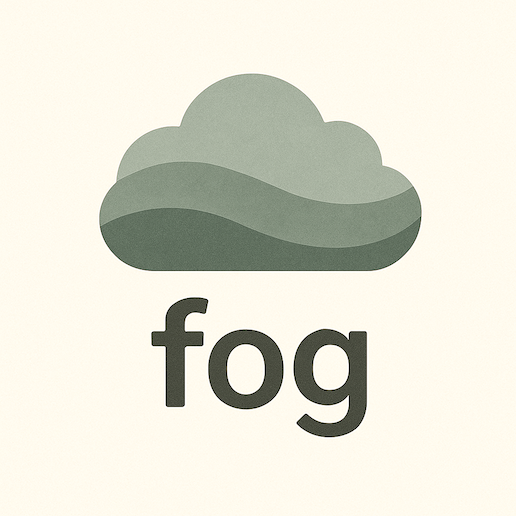
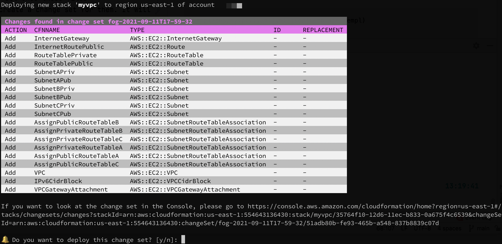
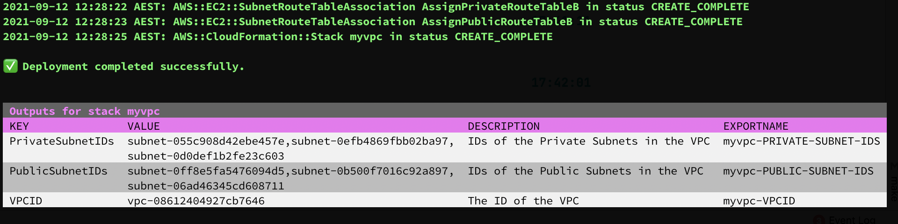
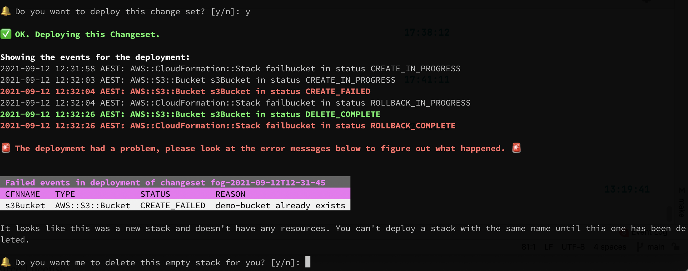
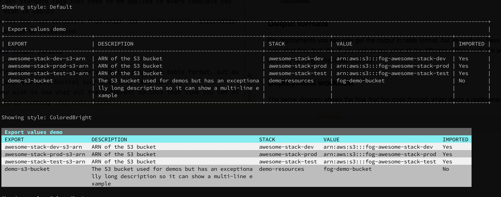

# fog

[](docs/fog-logo.png)

Fog is a tool to manage your CloudFormation deployments and ensure you have all your config as code. Please note, fog is **not** a DSL. It only works with standard CloudFormation files and doesn't do anything you can't do using the AWS CLI (and some hacking around with jq). It just makes it easier by combining functionality and preventing you from needing to deal with unnecessary overhead like different commands for creating a new stack or updating an existing one. In addition, it has little helper functionalities like offering to remove an empty stack for you.

## Deployments

The main functionality for fog is to carry out deployments of CloudFormation templates. The logic is based on bash scripts I've written and used with multiple clients over a number of years. You can do a deployment using the `fog deploy` command. You can see the help functionality for this and other commands by adding the `--help` flag.

```shell
$ fog deploy --help

deploy allows you to deploy a CloudFormation stack

It does so by creating a ChangeSet and then asking you for approval before continuing. You can automatically approve or only create or deploy a changeset by using flags.

A name for the changeset will automatically be generated based on your preferred name, but can be overwritten as well.

When providing tag and/or parameter files, you can add multiple files for each. These are parsed in the order provided and later values will override earlier ones.

Examples:

  fog deploy --stackname testvpc --template basicvpc --parameters vpc-private-only --tags "../globaltags/project,dev"
  fog deploy --stackname fails3 --template fails3 --non-interactive
  fog deploy --stackname myvpc --template basicvpc --parameters vpc-public --tags "../globaltags/project,dev" --config testconf/fog.yaml

Usage:
  fog deploy [flags]

Flags:
  -b, --bucket string            The S3 bucket where the template should be uploaded to (optional)
  -c, --changeset string         The name of the changeset, when not provided it will be autogenerated
      --create-changeset         Only create a change set
      --default-tags             Add any default tags that are specified in your config file (default true)
      --deploy-changeset         Deploy a specific change set
  -d, --deployment-file string   The file to use for the deployment
      --dry-run                  Do a dry run: create the changeset and immediately delete
  -h, --help                     help for deploy
      --non-interactive          Run in non-interactive mode: automatically approve the changeset and deploy
  -p, --parameters string        The file(s) containing the parameter values, comma-separated for multiple
  -n, --stackname string         The name for the stack
  -t, --tags string              The file(s) containing the tags, comma-separated for multiple
  -f, --template string          The filename for the template

Global Flags:
      --config string        config file (default is fog.yaml in current directory, or $HOME/fog.yaml)
      --debug                Enable debug mode, mainly for development purposes
      --file string          Optional file to save the output to, in addition to stdout
      --file-format string   Optional format for the file, defaults to the same as output
      --output string        Format for the output, currently supported are table, csv, json, and dot (for certain functions) (default "table")
      --profile string       Use a specific AWS profile
      --region string        Use a specific AWS region
      --timezone string      Specify a timezone you want to use for any times shown in output. By default it uses your system's timezone
  -v, --verbose              Give verbose output
```

Fog assumes that all values passed to it are stored in files. You can't pass parameters or tags as arguments, in an attempt to ensure that everything you do is stored in version control.

### Usage

An example for running a deployment would be

```shell
$ fog deploy --stackname myvpc --template myvpc --parameters myvpc-dev --tags globaltags/dev,myvpc
```

By default this will look for the following files:

```
templates/myvpc.(yaml|yml|json|template|templ)
parameters/myvpc-dev.json
tags/globaltags/dev.json
tags/myvpc.json
```

All of these paths and extensions can be overwritten in the config file, as explained further on. But once these files are found, fog will attempt to create a change set for them. It will then show an overview of the change set and ask whether you wish to deploy it.



If you want to proceed, it will then show you real-time progress of the deployment, similar to how the Console does this and if successfull it will show you a table of the outputs.



In the case of a failure, it will instead show you an overview of all the steps that failed and the details for why that happened.



If it's a new stack, it will even offer to delete the stack for you as you can't retry the deployment until that is done.

### Stack deployment files

At re:Invent 2023, AWS introduced the ability to automatically deploy CloudFormation stacks from your git repo, based on a [stack deployment file](https://docs.aws.amazon.com/AWSCloudFormation/latest/UserGuide/git-sync-concepts-terms.html?icmpid=docs_console_unmapped#git-sync-concepts-terms-depoyment-file). Fog supports using these same deployment-files as an alternative to the above configuration for parameter and tag files.

Example:

```bash
$ fog deploy --stackname myvpc --deployment-file vpc-private-only
```

This will then use the deployment file `vpc-private.(yaml|yml|json)` to get the template file (relative to the deployment file), defined parameters, and tags. You can't use parameter or tag files with a deployment file, but any tags defined in your config file will still be used.

As per the AWS documentation, a stack deployment file supports the following fields:

- template-file-path: this is relative to the deployment file
- parameters: key-value pairs of parameters
- tags: key-value pairs of tags

### Configuration

As you can see higher up, you can influence what is deployed using CLI arguments. For example, the `--non-interactive` flag will assume that you always say "yes" to questions like doing a deployment or deleting an empty stack on failure while `--create-changeset` will only create the change set so you can show it for review in your CI/CD tool before it is deployed after a manual approval.

Another way to influence what's run is to use a config file. This config file can be either a `yaml`, `json`, or `toml` file. Fog will by default check the current directory and your home directory (in that order), for a file named `fog.yaml|json|toml` but you can also provide a specific file using the `--config` file.

You can find an annotated example config in [example-fog.yaml](example-fog.yaml), or see its output by running `fog demo settings` but some highlights of the config file are:

* The ability to set the directories for templates/tags/parameters.
* Change the look of the table outputs (yes, that means you don't need to use the colours used in the screenshots)
* Set a standard name format for the change sets
* Set standard tags that need to be applied to every template you wish to deploy
* Set the root directory from which the `$TEMPLATEPATH` placeholder should be calculated

### Prechecks

It is possible to set up optional prechecks in your configuration file. These are commands that will be run before your deployment and you can ensure that a negative result from these checks will prevent deployment. For example, you can use this to ensure your templates succeed on [lint checks](https://github.com/aws-cloudformation/cfn-lint) or follow the rules defined in your [CloudFormation Guard](https://github.com/aws-cloudformation/cloudformation-guard) setup.

You set this up in your config file in the templates section, and you can define as many as you like. As with other settings, it allows the use of the `$TEMPLATEPATH` placeholder to define the template.

```yaml
templates:
  prechecks:
    - cfn-lint -t $TEMPLATEPATH #Use https://github.com/aws-cloudformation/cfn-lint
    - cfn-guard validate -d $TEMPLATEPATH --rules myrules #Use https://github.com/aws-cloudformation/cloudformation-guard
  stop-on-failed-prechecks: true
```

If you don't define `stop-on-failed-prechecks`, or set it to false, fog will continue with the deployment even if issues are found.

### Output formats

For deployments you can only get the output in table format, but as said you have control over what they look like. If you wish to see what all the different options look like you can do so by running `fog demo tables`.



Other commands add various output formats like json, csv, or sometimes dotfiles for graphs. This works similar to the AWS CLI as in that you can set a default in your config file and override it with the `--output` flag.

### Deployment workflow

The below diagram shows the flow that fog goes through when doing a deployment.


(If it's hard to read, open the linked SVG file in your graphics app of choice)

## fog report

Another major feature added is the ability to run a report on your CloudFormation stacks. This report will show the create/update/delete events of your stack, grouped by event and resource.

Running this with either the markdown or html output formats set will also add a timeline of the events in the form of a mermaid graph and if multiple stacks are requested it will add a table of contents to the top of the output.

You can write the output to a file using the --file flag.

Example of full output written to file:
```bash
$ fog report --stackname demovpc43 --output markdown --file docs/fog-report-demo.md
```

See [docs/fog-report-demo.md](docs/fog-report-demo.md) for the output.

Example of inline output:
```bash
$ fog report --stackname demovpc43 --output markdown --latest
```

<truncated header to not break the layout of the readme file>

| Stack | Account | Region | Type | Start time | Duration | Success |
| --- | --- | --- | --- | --- | --- | --- |
| demovpc43 | ignoreme-demo (1234567890) | ap-southeast-2 | Update | 2022-05-26T22:34:13+10:00 | 1m1s | ✅ |

#### Events of demovpc43 - Update event - Started 2022-05-26T22:34:13+10:00

| Action | CfnName | Type | ID | Start time | Duration | Success |
| --- | --- | --- | --- | --- | --- | --- |
| Add | InternetGateway | AWS::EC2::InternetGateway |  | 2022-05-26T22:34:17+10:00 | 19s | ✅ |
| Modify | VPC | AWS::EC2::VPC | vpc-0582693d136c8d1bd | 2022-05-26T22:34:18+10:00 | 3s | ✅ |
| Add | RouteTablePublic | AWS::EC2::RouteTable |  | 2022-05-26T22:34:21+10:00 | 13s | ✅ |
| Modify | RouteTablePrivate | AWS::EC2::RouteTable | rtb-02dda6c7d7dc07bdc | 2022-05-26T22:34:22+10:00 | 12s | ✅ |
| Add | SubnetAPub | AWS::EC2::Subnet |  | 2022-05-26T22:34:25+10:00 | 5s | ✅ |
| Add | SubnetCPub | AWS::EC2::Subnet |  | 2022-05-26T22:34:25+10:00 | 5s | ✅ |
| Modify | SubnetAPriv | AWS::EC2::Subnet | subnet-0d08715f3dc8719f0 | 2022-05-26T22:34:26+10:00 | 13s | ✅ |
| Add | SubnetBPub | AWS::EC2::Subnet |  | 2022-05-26T22:34:26+10:00 | 10s | ✅ |
| Modify | SubnetCPriv | AWS::EC2::Subnet | subnet-0ba29189e259b3b29 | 2022-05-26T22:34:26+10:00 | 13s | ✅ |
| Modify | SubnetBPriv | AWS::EC2::Subnet | subnet-0d96f06ce27d5c388 | 2022-05-26T22:34:26+10:00 | 17s | ✅ |
| Add | AssignPublicRouteTableB | AWS::EC2::SubnetRouteTableAssociation |  | 2022-05-26T22:34:37+10:00 | 7s | ✅ |
| Add | AssignPublicRouteTableC | AWS::EC2::SubnetRouteTableAssociation |  | 2022-05-26T22:34:37+10:00 | 3s | ✅ |
| Add | AssignPublicRouteTableA | AWS::EC2::SubnetRouteTableAssociation |  | 2022-05-26T22:34:37+10:00 | 7s | ✅ |
| Add | VPCGatewayAttachment | AWS::EC2::VPCGatewayAttachment |  | 2022-05-26T22:34:38+10:00 | 16s | ✅ |
| Add | InternetRoutePublic | AWS::EC2::Route |  | 2022-05-26T22:34:55+10:00 | 16s | ✅ |

```mermaid
gantt
        title Visual timeline of demovpc43 - Update event - Started 2022-05-26T22:34:13+10:00
        dateFormat HH:mm:ss
        axisFormat %H:%M:%S
        Stack UPDATE_IN_PROGRESS        :milestone, 22:34:13 , 0s
        InternetGateway :22:34:17 , 19s
        VPC     :active, 22:34:18 , 3s
        RouteTablePublic        :22:34:21 , 13s
        RouteTablePrivate       :active, 22:34:22 , 12s
        SubnetAPub      :22:34:25 , 5s
        SubnetCPub      :22:34:25 , 5s
        SubnetAPriv     :active, 22:34:26 , 13s
        SubnetBPub      :22:34:26 , 10s
        SubnetBPriv     :active, 22:34:26 , 17s
        SubnetCPriv     :active, 22:34:26 , 13s
        AssignPublicRouteTableC :22:34:37 , 3s
        AssignPublicRouteTableA :22:34:37 , 7s
        AssignPublicRouteTableB :22:34:37 , 7s
        VPCGatewayAttachment    :22:34:38 , 16s
        InternetRoutePublic     :22:34:55 , 16s
        Stack UPDATE_COMPLETE_CLEANUP_IN_PROGRESS       :milestone, 22:35:13 , 0s
        Stack UPDATE_COMPLETE   :milestone, 22:35:14 , 0s
```



## Other functionalities

While deployments and reports are the main features of fog, other commands have been added for convenience.

### fog exports

Running `fog exports` provides an overview of all CloudFormation exports in your current region. Key features include:

* Filtering exports by stack name, ID, or wildcard patterns (e.g., `--stackname "*dev*"`)
* Filtering exports by export name using wildcard patterns (e.g., `--export "*myproject*"`)
* Displaying whether exports are imported and, in verbose mode, showing which stacks imported them
* Sorting and customizing output formats, including CSV and JSON

Examples:

```shell
$ fog exports --stackname "*my*" --output csv

Exports for *my* in account <redacted> for region us-east-1
Export,Description,Stack,Value,Imported
myvpc-PRIVATE-SUBNET-IDS,IDs of the Private Subnets in the VPC,myvpc,"subnet-055c908d42ebe457e\,subnet-0efb4869fbb02ba97\,subnet-0d0def1b2fe23c603",No
myvpc-PUBLIC-SUBNET-IDS,IDs of the Public Subnets in the VPC,myvpc,"subnet-0ff8e5fa5476094d5\,subnet-0b500f7016c92a897\,subnet-06ad46345cd608711",No
myvpc-VPCID,The ID of the VPC,myvpc,vpc-08612404927cb7646,No
```

Verbose mode example:

```shell
$ fog exports --verbose

Exports for all stacks in account <redacted> for region us-east-1
Export,Description,Stack,Value,Imported,Imported By
myvpc-PRIVATE-SUBNET-IDS,IDs of the Private Subnets in the VPC,myvpc,"subnet-055c908d42ebe457e\,subnet-0efb4869fbb02ba97\,subnet-0d0def1b2fe23c603",No,
myvpc-PUBLIC-SUBNET-IDS,IDs of the Public Subnets in the VPC,myvpc,"subnet-0ff8e5fa5476094d5\,subnet-0b500f7016c92a897\,subnet-06ad46345cd608711",No,
myvpc-VPCID,The ID of the VPC,myvpc,vpc-08612404927cb7646,No,
```

### fog resources

This command let's you see all the resources managed by your CloudFormation templates.

The standard output shows the type, resource ID, and stack it's managed by. Verbose mode adds the logical ID in the CloudFormation stack and the status.

Using the stackname argument you can limit this to a specific stack using the stack's name or ID. If you provide a wildcard filter such as `*dev*` it will match all stacks that match that pattern.

```shell
fog resources --output json --verbose | jq .
[
  {
    "ID": "igw-04094534f89210d85",
    "LogicalID": "InternetGateway",
    "Stack": "myvpc",
    "Status": "UPDATE_COMPLETE",
    "Type": "AWS::EC2::InternetGateway"
  },
  {
    "ID": "myvpc-Inter-RLQ8UX2ASBHV",
    "LogicalID": "InternetRoutePublic",
    "Stack": "myvpc",
    "Status": "CREATE_COMPLETE",
    "Type": "AWS::EC2::Route"
  },
  ...<truncated>
]
```

### fog dependencies

This will show your stacks and any dependencies that exist between them.

Dependencies can prevent updates from happening or prevent a stack from getting deleted. Right now dependencies being shown are export values that are imperted by other stacks. Upcoming is support for showing nested stacks.

This function supports the "dot" output format, which outputs the dependencies in a way that you can turn into a graphical format using a tool like [graphviz](https://graphviz.org).

```shell
fog dependencies --stackname "myvpc" --output dot | dot -T png -o docs/fog-dependencies-demo.png
```


### fog drift

Fog's drift detection builds upon the built-in drift detection from CloudFormation, but adds several enhancements and new capabilities:

#### Enhanced Drift Detection Features

* **Tag handling**: Ignoring differences caused by the order of tags and allowing specific tags to be ignored in drift results
* **Route table monitoring**: Detecting differences in route tables, including unmanaged or removed routes
* **NACL monitoring**: Detecting differences in NACL rules, including unmanaged or removed entries, with improved IPv6 CIDR block handling
* **Prefix list support**: Supporting verbose mode to detect prefix list changes in routes (excluding AWS-managed prefix lists)
* **Blackhole route filtering**: Option to ignore specific blackhole routes via configuration

#### Unmanaged Resource Detection

Fog can now detect AWS resources that exist in your account but are not managed by CloudFormation:

* **SSO/Identity Center resources**: Detect unmanaged SSO Permission Sets and Assignments
* **Configurable resource types**: Support for detecting any AWS resource type via configuration
* **Ignore lists**: Configure specific resources to ignore in unmanaged resource detection

#### Configuration Options

Configure drift detection behavior in your `fog.yaml`:

```yaml
drift:
  ignore-tags:
    - AWS::EC2::TransitGatewayAttachment:Application  # Ignore specific tags by resource type
  ignore-blackholes:
    - pcx-0887c71683c64bb22  # Ignore specific blackhole routes
  detect-unmanaged-resources:
    - AWS::SSO::PermissionSet  # Detect unmanaged SSO Permission Sets
    - AWS::SSO::Assignment     # Detect unmanaged SSO Assignments
  ignore-unmanaged-resources:
    - "arn:aws:sso:::instance/ssoins-xxx|arn:aws:sso:::permissionSet/ssoins-xxx/ps-xxx"  # Ignore specific unmanaged resources
```

#### Command Line Options

* `--results-only` (`-r`): Don't trigger a new drift detection, use existing results
* `--separate-properties` (`-s`): Put every property difference on its own line for better readability
* `--ignore-tags` (`-i`): Comma-separated list of additional tags to ignore
* `--verbose` (`-v`): Show prefix list changes in routes (excluding AWS-managed prefix lists)

## TODO

There is a lot more planned for the application, and a roadmap etc. will soon show up on GitHub.

## Flag system

Fog commands use a modular flag system built around **flag groups**. Groups live
under `cmd/flags` and provide shared validation rules that are automatically
applied when a command registers the group. The validator aggregates all rules
so each command only needs to call `Validate` once before running.

The legacy implementation in `cmd/flaggroups.go` will be removed when all
commands have migrated to the new groups, so treat it as deprecated.

## Error Handling

Fog commands report problems using the structured `FogError` type. Errors are
classified with codes and categories so they can be formatted consistently. See
[docs/error-handling.md](docs/error-handling.md) for an overview of the error
system, how to add new codes and how to enable verbose output with the
`--verbose` flag.

## Contributions

If you wish to contribute in any way (reporting bugs, requesting features, writing code), feel free to do so either by opening Issues or Pull Requests. For Pull Requests, just follow the standard pattern.

1. Fork the repository
2. Make your changes
3. Make a pull request that explains what it does
