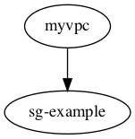

# fog

Fog is a tool to manage your CloudFormation deployments and ensure you have all your config as code. Please note, fog is **not** a DSL. It only works with standard CloudFormation files and doesn't do anything you can't do using the AWS CLI (and some hacking around with jq). It just makes it easier by combining functionality and preventing you from needing to deal with unnecesary overhead like different commands for creating a new stack or updating an existing one. In addition, it has little helper functionalities like offering to remove an empty stack for you.

## Deployments

The main functionality for fog is to carry out deployments of CloudFormation templates. The logic is based on bash scripts I've written and used with multiple clients over a number of years. You can do a deployment using the `fog deploy` command. You can see the help functionality for this and other commands by adding the `--help`
flag.

```shell
$ fog deploy --help

deploy allows you to deploy a CloudFormation stack

It does so by creating a ChangeSet and then asking you for approval before continuing. You can automatically approve or only create or deploy a changeset by using flags.

A name for the changeset will automatically be generated based on your preferred name, but can be overwritten as well.

When providing tag and/or parameter files, you can add multiple files for each. These are parsed in the order provided and later values will override earlier ones.

Examples: fog deploy mytemplate

Usage:
  fog deploy [flags]

Flags:
  -b, --bucket string       The S3 bucket where the template should be uploaded to (optional)
  -c, --changeset string    The name of the changeset, when not provided it will be autogenerated
      --create-changeset    Only create a change set
      --default-tags        Add any default tags that are specified in your config file (default true)
      --deploy-changeset    Deploy a specific change set
      --dry-run             Do a dry run: create the changeset and immediately delete
  -h, --help                help for deploy
      --non-interactive     Run in non-interactive mode: automatically approve the changeset and deploy
  -p, --parameters string   The file(s) containing the parameter values, comma-separated for multiple
  -n, --stackname string    The name for the stack
  -t, --tags string         The file(s) containing the tags, comma-separated for multiple
  -f, --template string     The filename for the template
  
Global Flags:
      --config string    config file (default is fog.yaml in current directory, or $HOME/fog.yaml)
      --output string    Format for the output, currently supported are table, csv, json, and dot (for certain functions) (default "table")
      --profile string   Use a specific AWS profile
      --region string    Use a specific AWS region
  -v, --verbose          Give verbose output
```

Fog assumes that all values passed to it are stored in files. You can't pass parameters or tags as arguments, in an attempt to ensure that everything you do is stored in version control.

### Usage

An example for running a deployment would be

```shell
$ fog deploy --template myvpc --parameters myvpc-dev --tags globaltags/dev,myvpc
```

By default this will look for the following files:

```
templates/myvpc.(yaml|yml|json|template|templ)
parameters/myvpc-dev.json
tags/globaltags/dev.json
tags/myvpc.json
```

All of these paths and extensions can be overwritten in the config file, as explained further on. But once these files are found, fog will attempt to create a change set for them. It will then show an overview of the change set and ask whether you wish to deploy it.


If you want to proceed, it will then show you real-time progress of the deployment, similar to how the Console does this and if successfull it will show you a table of the outputs.


In the case of a failure, it will instead show you an overview of all the steps that failed and the details for why that happened.


If it's a new stack, it will even offer to delete the stack for you as you can't retry the deployment until that is done.

### Configuration

As you can see higher up, you can influence what is deployed using CLI arguments. For example, the `--non-interactive` flag will assume that you always say "yes" to questions like doing a deployment or deleting an empty stack on failure while `--create-changeset` will only create the change set so you can show it for review in your CI/CD tool before it is deployed after a manual approval.

Another way to influence what's run is to use a config file. This config file can be either a `yaml`, `json`, or `toml` file. Fog will by default check the current directory and your home directory (in that order), for a file named `fog.yaml|json|toml` but you can also provide a specific file using the `--config` file.

You can find an annotated example config in [example-fog.yaml](example-fog.yaml), or see its output by running `fog demo settings` but some highlights of the config file are:

* The ability to set the directories for templates/tags/parameters.
* Change the look of the table outputs (yes, that means you don't need to use the colours used in the screenshots)
* Set a standard name format for the change sets
* Set standard tags that need to be applied to every template you wish to deploy
* Set the root directory from which the `$TEMPLATEPATH` placeholder should be calculated

### Output formats

For deployments you can only get the output in table format, but as said you have control over what they look like. If you wish to see what all the different options look like you can do so by running `fog demo tables`.


Other commands add various output formats like json, csv, or sometimes dotfiles for graphs. This works similar to the AWS CLI as in that you can set a default in your config file and override it with the `--output` flag.

### Deployment workflow

The below diagram shows the flow that fog goes through when doing a deployment.


(If it's hard to read, open the linked SVG file in your graphics app of choice)

## Other functionalities

While deployments are the main feature of fog, other commands have been added for convenience.

### fog exports

Running `fog exports` allows you to get an overview of all the exports in your current region. It will also show you whether they have been imported and by adding the `--verbose` flag it will show you by which stack. In addition, you can filter by either the stack name or export name, including the use of wildcards.

```shell
$ fog exports --stackname "*my*" --output csv

Exports for *my* in account <redacted> for region us-east-1
Export,Description,Stack,Value,Imported
myvpc-PRIVATE-SUBNET-IDS,IDs of the Private Subnets in the VPC,myvpc,"subnet-055c908d42ebe457e\,subnet-0efb4869fbb02ba97\,subnet-0d0def1b2fe23c603",No
myvpc-PUBLIC-SUBNET-IDS,IDs of the Public Subnets in the VPC,myvpc,"subnet-0ff8e5fa5476094d5\,subnet-0b500f7016c92a897\,subnet-06ad46345cd608711",No
myvpc-VPCID,The ID of the VPC,myvpc,vpc-08612404927cb7646,No
```

### fog resources

This command let's you see all the resources managed by your CloudFormation templates.

The standard output shows the type, resource ID, and stack it's managed by. Verbose mode adds the logical ID in the CloudFormation stack and the status.

Using the stackname argument you can limit this to a specific stack using the stack's name or ID. If you provide a wildcard filter such as `*dev*` it will match all stacks that match that pattern.

```shell
fog resources --output json --verbose | jq .
[
  {
    "ID": "igw-04094534f89210d85",
    "LogicalID": "InternetGateway",
    "Stack": "myvpc",
    "Status": "UPDATE_COMPLETE",
    "Type": "AWS::EC2::InternetGateway"
  },
  {
    "ID": "myvpc-Inter-RLQ8UX2ASBHV",
    "LogicalID": "InternetRoutePublic",
    "Stack": "myvpc",
    "Status": "CREATE_COMPLETE",
    "Type": "AWS::EC2::Route"
  },
  ...<truncated>
]
```

### fog dependencies

This will show your stacks and any dependencies that exist between them.

Dependencies can prevent updates from happening or prevent a stack from getting deleted. Right now dependencies being shown are export values that are imperted by other stacks. Upcoming is support for showing nested stacks.

This function supports the "dot" output format, which outputs the dependencies in a way that you can turn into a graphical format using a tool like [graphviz](https://graphviz.org).

```shell
fog dependencies --stackname "myvpc" --output dot | dot -T png -o docs/fog-dependencies-demo.png
```



## TODO

There is a lot more planned for the application, and a roadmap etc. will soon show up on GitHub.

## Contributions

If you wish to contribute in any way (reporting bugs, requesting features, writing code), feel free to do so either by opening Issues or Pull Requests. For Pull Requests, just follow the standard pattern.

1. Fork the repository
2. Make your changes
3. Make a pull request that explains what it does
