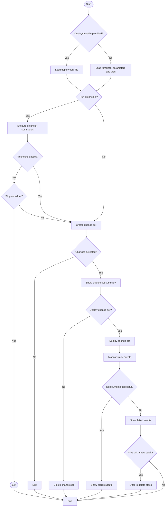

# Deploying CloudFormation Stacks

Fog's primary command is `fog deploy`. It takes a template and optional parameter and tag files to create or update a stack through a Change Set. The command validates your input, optionally runs precheck commands and then asks for confirmation before the deployment proceeds. During the deployment Fog streams the stack events so you can follow progress in real time.

This flow illustrates the high level steps Fog takes when deploying a stack.
