# Fog report for stack demovpc43

## Stack demovpc43
#### Metadata of demovpc43 - Create event - Started 2022-05-24T22:59:18+10:00

| Stack | Account | Region | Type | Start time | Duration | Success |
| --- | --- | --- | --- | --- | --- | --- |
| demovpc43 | ignoreme-demo (1234567890) | ap-southeast-2 | Create | 2022-05-24T22:59:18+10:00 | 1m6s | ✅ |

#### Events of demovpc43 - Create event - Started 2022-05-24T22:59:18+10:00

| Action | CfnName | Type | ID | Start time | Duration | Success |
| --- | --- | --- | --- | --- | --- | --- |
| Add | VPC | AWS::EC2::VPC |  | 2022-05-24T22:59:30+10:00 | 15s | ✅ |
| Add | RouteTablePrivate | AWS::EC2::RouteTable |  | 2022-05-24T22:59:46+10:00 | 14s | ✅ |
| Add | IPv6CidrBlock | AWS::EC2::VPCCidrBlock |  | 2022-05-24T22:59:46+10:00 | 16s | ✅ |
| Add | SubnetCPriv | AWS::EC2::Subnet |  | 2022-05-24T23:00:09+10:00 | 6s | ✅ |
| Add | SubnetAPriv | AWS::EC2::Subnet |  | 2022-05-24T23:00:10+10:00 | 6s | ✅ |
| Add | SubnetBPriv | AWS::EC2::Subnet |  | 2022-05-24T23:00:11+10:00 | 6s | ✅ |
| Add | AssignPrivateRouteTableC | AWS::EC2::SubnetRouteTableAssociation |  | 2022-05-24T23:00:17+10:00 | 3s | ✅ |
| Add | AssignPrivateRouteTableA | AWS::EC2::SubnetRouteTableAssociation |  | 2022-05-24T23:00:18+10:00 | 3s | ✅ |
| Add | AssignPrivateRouteTableB | AWS::EC2::SubnetRouteTableAssociation |  | 2022-05-24T23:00:18+10:00 | 4s | ✅ |

```mermaid
gantt
	title Visual timeline of demovpc43 - Create event - Started 2022-05-24T22:59:18+10:00
	dateFormat HH:mm:ss
	axisFormat %H:%M:%S
	VPC	:22:59:30 , 15s
	RouteTablePrivate	:22:59:46 , 14s
	IPv6CidrBlock	:22:59:46 , 16s
	SubnetCPriv	:23:00:09 , 6s
	SubnetAPriv	:23:00:10 , 6s
	SubnetBPriv	:23:00:11 , 6s
	AssignPrivateRouteTableC	:23:00:17 , 3s
	AssignPrivateRouteTableA	:23:00:18 , 3s
	AssignPrivateRouteTableB	:23:00:18 , 4s
```

#### Metadata of demovpc43 - Update event - Started 2022-05-26T22:21:59+10:00

| Stack | Account | Region | Type | Start time | Duration | Success |
| --- | --- | --- | --- | --- | --- | --- |
| demovpc43 | ignoreme-demo (1234567890) | ap-southeast-2 | Update | 2022-05-26T22:21:59+10:00 | 1m2s | ✅ |

#### Events of demovpc43 - Update event - Started 2022-05-26T22:21:59+10:00

| Action | CfnName | Type | ID | Start time | Duration | Success |
| --- | --- | --- | --- | --- | --- | --- |
| Add | RouteTablePublic | AWS::EC2::RouteTable |  | 2022-05-26T22:22:04+10:00 | 14s | ✅ |
| Add | InternetGateway | AWS::EC2::InternetGateway |  | 2022-05-26T22:22:04+10:00 | 18s | ✅ |
| Add | SubnetBPub | AWS::EC2::Subnet |  | 2022-05-26T22:22:07+10:00 | 6s | ✅ |
| Add | SubnetAPub | AWS::EC2::Subnet |  | 2022-05-26T22:22:08+10:00 | 7s | ✅ |
| Add | SubnetCPub | AWS::EC2::Subnet |  | 2022-05-26T22:22:08+10:00 | 7s | ✅ |
| Add | AssignPublicRouteTableB | AWS::EC2::SubnetRouteTableAssociation |  | 2022-05-26T22:22:19+10:00 | 3s | ✅ |
| Add | AssignPublicRouteTableC | AWS::EC2::SubnetRouteTableAssociation |  | 2022-05-26T22:22:19+10:00 | 3s | ✅ |
| Add | AssignPublicRouteTableA | AWS::EC2::SubnetRouteTableAssociation |  | 2022-05-26T22:22:19+10:00 | 3s | ✅ |
| Add | VPCGatewayAttachment | AWS::EC2::VPCGatewayAttachment |  | 2022-05-26T22:22:24+10:00 | 16s | ✅ |
| Add | InternetRoutePublic | AWS::EC2::Route |  | 2022-05-26T22:22:42+10:00 | 16s | ✅ |

```mermaid
gantt
	title Visual timeline of demovpc43 - Update event - Started 2022-05-26T22:21:59+10:00
	dateFormat HH:mm:ss
	axisFormat %H:%M:%S
	RouteTablePublic	:22:22:04 , 14s
	InternetGateway	:22:22:04 , 18s
	SubnetBPub	:22:22:07 , 6s
	SubnetAPub	:22:22:08 , 7s
	SubnetCPub	:22:22:08 , 7s
	AssignPublicRouteTableB	:22:22:19 , 3s
	AssignPublicRouteTableC	:22:22:19 , 3s
	AssignPublicRouteTableA	:22:22:19 , 3s
	VPCGatewayAttachment	:22:22:24 , 16s
	InternetRoutePublic	:22:22:42 , 16s
```

#### Metadata of demovpc43 - Update event - Started 2022-05-26T22:26:14+10:00

| Stack | Account | Region | Type | Start time | Duration | Success |
| --- | --- | --- | --- | --- | --- | --- |
| demovpc43 | ignoreme-demo (1234567890) | ap-southeast-2 | Update | 2022-05-26T22:26:14+10:00 | 51s | ✅ |

#### Events of demovpc43 - Update event - Started 2022-05-26T22:26:14+10:00

| Action | CfnName | Type | ID | Start time | Duration | Success |
| --- | --- | --- | --- | --- | --- | --- |
| Remove | AssignPublicRouteTableC | AWS::EC2::SubnetRouteTableAssociation | rtbassoc-07e158ed3d013f4e5 | 2022-05-26T22:26:20+10:00 | 18s | ✅ |
| Remove | AssignPublicRouteTableB | AWS::EC2::SubnetRouteTableAssociation | rtbassoc-0cfc8ab9de75602f7 | 2022-05-26T22:26:20+10:00 | 40s | ✅ |
| Remove | AssignPublicRouteTableA | AWS::EC2::SubnetRouteTableAssociation | rtbassoc-0b1b8403b57ff4fb0 | 2022-05-26T22:26:20+10:00 | 18s | ✅ |
| Remove | InternetRoutePublic | AWS::EC2::Route | demov-Inter-7YX05HCKHEBZ | 2022-05-26T22:26:20+10:00 | 16s | ✅ |
| Remove | VPCGatewayAttachment | AWS::EC2::VPCGatewayAttachment | demov-VPCGa-1X5LP6NYOYMGF | 2022-05-26T22:26:36+10:00 | 16s | ✅ |
| Remove | SubnetCPub | AWS::EC2::Subnet | subnet-0ec02d1aba5f30309 | 2022-05-26T22:26:38+10:00 | 2s | ✅ |
| Remove | SubnetAPub | AWS::EC2::Subnet | subnet-0d73c4ce7493e9ebd | 2022-05-26T22:26:38+10:00 | 2s | ✅ |
| Remove | InternetGateway | AWS::EC2::InternetGateway | igw-0895cc8304626798f | 2022-05-26T22:26:53+10:00 | 2s | ✅ |
| Remove | SubnetBPub | AWS::EC2::Subnet | subnet-0575b9f25cca7aefd | 2022-05-26T22:27:01+10:00 | 2s | ✅ |
| Remove | RouteTablePublic | AWS::EC2::RouteTable | rtb-08072a8d34d1622f6 | 2022-05-26T22:27:02+10:00 | 2s | ✅ |

```mermaid
gantt
	title Visual timeline of demovpc43 - Update event - Started 2022-05-26T22:26:14+10:00
	dateFormat HH:mm:ss
	axisFormat %H:%M:%S
	AssignPublicRouteTableC	:crit, 22:26:20 , 18s
	AssignPublicRouteTableB	:crit, 22:26:20 , 40s
	AssignPublicRouteTableA	:crit, 22:26:20 , 18s
	InternetRoutePublic	:crit, 22:26:20 , 16s
	VPCGatewayAttachment	:crit, 22:26:36 , 16s
	SubnetCPub	:crit, 22:26:38 , 2s
	SubnetAPub	:crit, 22:26:38 , 2s
	InternetGateway	:crit, 22:26:53 , 2s
	SubnetBPub	:crit, 22:27:01 , 2s
	RouteTablePublic	:crit, 22:27:02 , 2s
```

#### Metadata of demovpc43 - Update event - Started 2022-05-26T22:34:13+10:00

| Stack | Account | Region | Type | Start time | Duration | Success |
| --- | --- | --- | --- | --- | --- | --- |
| demovpc43 | ignoreme-demo (1234567890) | ap-southeast-2 | Update | 2022-05-26T22:34:13+10:00 | 1m1s | ✅ |

#### Events of demovpc43 - Update event - Started 2022-05-26T22:34:13+10:00

| Action | CfnName | Type | ID | Start time | Duration | Success |
| --- | --- | --- | --- | --- | --- | --- |
| Add | InternetGateway | AWS::EC2::InternetGateway |  | 2022-05-26T22:34:17+10:00 | 19s | ✅ |
| Modify | VPC | AWS::EC2::VPC | vpc-0582693d136c8d1bd | 2022-05-26T22:34:18+10:00 | 3s | ✅ |
| Add | RouteTablePublic | AWS::EC2::RouteTable |  | 2022-05-26T22:34:21+10:00 | 13s | ✅ |
| Modify | RouteTablePrivate | AWS::EC2::RouteTable | rtb-02dda6c7d7dc07bdc | 2022-05-26T22:34:22+10:00 | 12s | ✅ |
| Add | SubnetCPub | AWS::EC2::Subnet |  | 2022-05-26T22:34:25+10:00 | 5s | ✅ |
| Add | SubnetAPub | AWS::EC2::Subnet |  | 2022-05-26T22:34:25+10:00 | 5s | ✅ |
| Modify | SubnetCPriv | AWS::EC2::Subnet | subnet-0ba29189e259b3b29 | 2022-05-26T22:34:26+10:00 | 13s | ✅ |
| Add | SubnetBPub | AWS::EC2::Subnet |  | 2022-05-26T22:34:26+10:00 | 10s | ✅ |
| Modify | SubnetAPriv | AWS::EC2::Subnet | subnet-0d08715f3dc8719f0 | 2022-05-26T22:34:26+10:00 | 13s | ✅ |
| Modify | SubnetBPriv | AWS::EC2::Subnet | subnet-0d96f06ce27d5c388 | 2022-05-26T22:34:26+10:00 | 17s | ✅ |
| Add | AssignPublicRouteTableC | AWS::EC2::SubnetRouteTableAssociation |  | 2022-05-26T22:34:37+10:00 | 3s | ✅ |
| Add | AssignPublicRouteTableA | AWS::EC2::SubnetRouteTableAssociation |  | 2022-05-26T22:34:37+10:00 | 7s | ✅ |
| Add | AssignPublicRouteTableB | AWS::EC2::SubnetRouteTableAssociation |  | 2022-05-26T22:34:37+10:00 | 7s | ✅ |
| Add | VPCGatewayAttachment | AWS::EC2::VPCGatewayAttachment |  | 2022-05-26T22:34:38+10:00 | 16s | ✅ |
| Add | InternetRoutePublic | AWS::EC2::Route |  | 2022-05-26T22:34:55+10:00 | 16s | ✅ |

```mermaid
gantt
	title Visual timeline of demovpc43 - Update event - Started 2022-05-26T22:34:13+10:00
	dateFormat HH:mm:ss
	axisFormat %H:%M:%S
	InternetGateway	:22:34:17 , 19s
	VPC	:active, 22:34:18 , 3s
	RouteTablePublic	:22:34:21 , 13s
	RouteTablePrivate	:active, 22:34:22 , 12s
	SubnetCPub	:22:34:25 , 5s
	SubnetAPub	:22:34:25 , 5s
	SubnetCPriv	:active, 22:34:26 , 13s
	SubnetBPub	:22:34:26 , 10s
	SubnetAPriv	:active, 22:34:26 , 13s
	SubnetBPriv	:active, 22:34:26 , 17s
	AssignPublicRouteTableC	:22:34:37 , 3s
	AssignPublicRouteTableA	:22:34:37 , 7s
	AssignPublicRouteTableB	:22:34:37 , 7s
	VPCGatewayAttachment	:22:34:38 , 16s
	InternetRoutePublic	:22:34:55 , 16s
```

