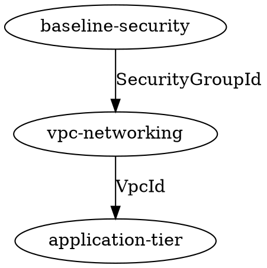

# StackSets Architecture Integration for Fog

**Research Date:** 2025-11-16
**Purpose:** Design how StackSets functionality integrates with fog's existing architecture

## Architecture Overview

This document outlines how AWS CloudFormation StackSets capabilities can be integrated into fog while maintaining consistency with existing architectural patterns and design principles.

## Integration Principles

### 1. Consistency with Existing Patterns

StackSet features should follow fog's established patterns:

- **Command Structure**: Use Cobra command groups (similar to `stack` and `resource`)
- **Flag Groups**: Modular flag definitions with validation
- **Service Layer**: Business logic separated from command handling
- **Interface-Based**: AWS operations behind testable interfaces
- **Output Flexibility**: Support all existing output formats (table, CSV, JSON, dot, markdown, HTML, YAML)
- **Configuration**: Leverage Viper configuration system

### 2. Progressive Enhancement

StackSets should enhance fog's capabilities without disrupting existing workflows:

- Existing stack commands remain unchanged
- StackSets are an additional capability, not a replacement
- Users can gradually adopt StackSet features
- No breaking changes to current commands

### 3. Minimal Dependency

Leverage existing fog infrastructure:

- Reuse AWS client configuration (`config.AWSConfig`)
- Utilize existing output builders
- Apply current error handling patterns
- Use established logging mechanisms

## Proposed Directory Structure

```
/home/user/fog/
├── cmd/
│   ├── stackset.go                    # NEW: StackSet root command
│   ├── stackset_list.go               # NEW: List StackSets
│   ├── stackset_describe.go           # NEW: Describe StackSet
│   ├── stackset_instances.go          # NEW: List instances
│   ├── stackset_deploy.go             # NEW: Deploy/update StackSet
│   ├── stackset_delete.go             # NEW: Delete StackSet
│   ├── stackset_delete_instances.go   # NEW: Delete instances
│   ├── stackset_operations.go         # NEW: List operations
│   ├── stackset_drift.go              # NEW: Drift detection
│   ├── stackset_helpers.go            # NEW: Shared helper functions
│   └── flaggroups.go                  # MODIFY: Add StackSet flag groups
├── lib/
│   ├── stacksets.go                   # NEW: Core StackSet operations
│   ├── stackset_instances.go          # NEW: Instance operations
│   ├── stackset_operations.go         # NEW: Operation tracking
│   ├── stackset_drift.go              # NEW: Drift detection for StackSets
│   └── interfaces.go                  # MODIFY: Add StackSet interfaces
├── config/
│   ├── awsconfig.go                   # MODIFY: Add CloudFormation client getter
│   └── config.go                      # MODIFY: StackSet config settings
└── testdata/
    └── stacksets/                     # NEW: StackSet test fixtures
        ├── templates/
        ├── parameters/
        └── deployment-targets/
```

## Core Components

### 1. Command Layer (`cmd/`)

#### StackSet Command Group

**File:** `cmd/stackset.go`

```go
// Root command for StackSet operations
var stacksetCmd = &cobra.Command{
    Use:   "stackset",
    Short: "Manage AWS CloudFormation StackSets",
    Long: `Deploy and manage CloudFormation stacks across multiple
AWS accounts and regions using StackSets.`,
}

// Subcommands
- stackset list           # List all StackSets
- stackset describe       # Describe specific StackSet
- stackset instances      # List instances for a StackSet
- stackset deploy         # Create/update StackSet and instances
- stackset update-instances  # Update specific instances
- stackset delete-instances  # Delete specific instances
- stackset delete         # Delete StackSet
- stackset operations     # List operations
- stackset drift          # Detect drift
```

#### Flag Groups

**File:** `cmd/flaggroups.go` (additions)

```go
// StackSetListFlags for listing StackSets
type StackSetListFlags struct {
    Status    string   // Filter by status: ACTIVE, DELETED
    MaxItems  int32    // Pagination limit
}

// StackSetDeployFlags for deploying StackSets
type StackSetDeployFlags struct {
    // StackSet Identity
    StackSetName        string
    Description         string

    // Template and Parameters
    Template            string
    Parameters          string
    ParameterOverrides  string   // JSON/YAML file with account/region overrides
    Tags                string

    // Deployment Targets
    Accounts            []string   // Target account IDs
    Regions             []string   // Target regions
    OrganizationalUnits []string   // Target OUs (service-managed only)

    // Permission Model
    PermissionModel     string   // SELF_MANAGED or SERVICE_MANAGED
    AdminRoleARN        string   // For self-managed
    ExecutionRoleName   string   // For self-managed

    // Deployment Preferences
    RegionOrder            []string
    FailureToleranceCount  *int32
    FailureTolerancePercent *int32
    MaxConcurrentCount     *int32
    MaxConcurrentPercent   *int32
    RegionConcurrency      string   // SEQUENTIAL or PARALLEL
    ConcurrencyMode        string   // STRICT_FAILURE_TOLERANCE or SOFT_FAILURE_TOLERANCE

    // Operation Options
    OperationID         string   // Client request token
    ManagedExecution    bool     // Enable managed execution
    AutoDeployment      bool     // Enable auto deployment (service-managed only)

    // Fog-specific Options
    DryRun              bool     // Show what would be deployed
    NonInteractive      bool     // Skip confirmations
    DeploymentFile      string   // StackSet deployment file
    Quiet               bool     // Suppress progress output
    CreateOnly          bool     # Only create StackSet, don't create instances
    UpdateInstances     bool     # Update instances for existing StackSet
}

// StackSetInstancesFlags for listing instances
type StackSetInstancesFlags struct {
    StackSetName    string
    Account         string     // Filter by account
    Region          string     // Filter by region
    Status          string     // Filter by status
    MaxItems        int32      // Pagination limit
}

// StackSetOperationsFlags for listing operations
type StackSetOperationsFlags struct {
    StackSetName  string
    MaxItems      int32
}

// StackSetDriftFlags for drift detection
type StackSetDriftFlags struct {
    StackSetName         string
    OperationPreferences string   // JSON/YAML file with operation preferences
    ResultsOnly          bool     // Don't trigger detection, show existing results
}
```

### 2. Library Layer (`lib/`)

#### Core StackSet Operations

**File:** `lib/stacksets.go`

```go
// StackSetInfo represents a StackSet with its metadata
type StackSetInfo struct {
    StackSetName           string
    StackSetID             string
    Description            string
    Status                 string
    Template               string
    Parameters             []types.Parameter
    Tags                   []types.Tag
    Capabilities           []types.Capability
    PermissionModel        string
    AutoDeployment         *types.AutoDeployment
    ManagedExecution       *types.ManagedExecution
    OrganizationalUnitIDs  []string
    DriftStatus            string
    LastDriftCheckTime     *time.Time
}

// StackInstanceInfo represents a stack instance
type StackInstanceInfo struct {
    StackSetID         string
    StackSetName       string
    Account            string
    Region             string
    Status             string
    StatusReason       string
    StackID            string
    ParameterOverrides []types.Parameter
    DriftStatus        string
    LastDriftCheckTime *time.Time
    LastOperationID    string
}

// StackSetOperationInfo represents a StackSet operation
type StackSetOperationInfo struct {
    OperationID              string
    Action                   string   // CREATE, UPDATE, DELETE
    Status                   string
    CreationTime             time.Time
    EndTime                  *time.Time
    OperationPreferences     types.StackSetOperationPreferences
    RetainStacks             bool
    StacksSucceeded          int32
    StacksFailed             int32
    StacksInProgress         int32
    StacksPending            int32
    StacksStopped            int32
}

// Core Functions
func GetStackSet(client CloudFormationStackSetAPI, stackSetName string) (*StackSetInfo, error)
func ListStackSets(client CloudFormationStackSetAPI, status string) ([]StackSetInfo, error)
func CreateStackSet(client CloudFormationStackSetAPI, info *StackSetDeployInfo) (string, error)
func UpdateStackSet(client CloudFormationStackSetAPI, info *StackSetDeployInfo) (string, error)
func DeleteStackSet(client CloudFormationStackSetAPI, stackSetName string) error
func StackSetExists(client CloudFormationStackSetAPI, stackSetName string) (bool, error)
```

#### Stack Instance Operations

**File:** `lib/stackset_instances.go`

```go
// DeploymentTarget represents where instances should be deployed
type DeploymentTarget struct {
    Accounts               []string
    OrganizationalUnitIDs  []string
    AccountFilterType      string   // NONE, INTERSECTION, DIFFERENCE, UNION
}

// Core Functions
func ListStackInstances(client CloudFormationStackSetAPI, stackSetName string, filters *InstanceFilters) ([]StackInstanceInfo, error)
func GetStackInstance(client CloudFormationStackSetAPI, stackSetName, account, region string) (*StackInstanceInfo, error)
func CreateStackInstances(client CloudFormationStackSetAPI, config *InstanceDeployConfig) (string, error)
func UpdateStackInstances(client CloudFormationStackSetAPI, config *InstanceUpdateConfig) (string, error)
func DeleteStackInstances(client CloudFormationStackSetAPI, config *InstanceDeleteConfig) (string, error)
```

#### Operation Tracking

**File:** `lib/stackset_operations.go`

```go
// Core Functions
func ListStackSetOperations(client CloudFormationStackSetAPI, stackSetName string) ([]StackSetOperationInfo, error)
func DescribeStackSetOperation(client CloudFormationStackSetAPI, stackSetName, operationID string) (*StackSetOperationInfo, error)
func ListOperationResults(client CloudFormationStackSetAPI, stackSetName, operationID string) ([]OperationResult, error)
func WaitForOperationComplete(client CloudFormationStackSetAPI, stackSetName, operationID string, opts ...WaitOption) error
func StopStackSetOperation(client CloudFormationStackSetAPI, stackSetName, operationID string) error

// OperationResult represents per-instance operation result
type OperationResult struct {
    Account       string
    Region        string
    Status        string
    StatusReason  string
}

// WaitOption for configurable waiting
type WaitOption func(*WaitConfig)
func WithTimeout(duration time.Duration) WaitOption
func WithPollInterval(duration time.Duration) WaitOption
func WithProgressCallback(callback func(operation *StackSetOperationInfo)) WaitOption
```

#### Drift Detection

**File:** `lib/stackset_drift.go`

```go
// Core Functions
func DetectStackSetDrift(client CloudFormationStackSetAPI, stackSetName string, opPrefs *types.StackSetOperationPreferences) (string, error)
func GetStackSetDriftStatus(client CloudFormationStackSetAPI, stackSetName, operationID string) (*StackSetDriftInfo, error)
func ListStackInstanceDriftResults(client CloudFormationStackSetAPI, stackSetName, operationID string) ([]StackInstanceDriftInfo, error)

// StackSetDriftInfo represents drift status
type StackSetDriftInfo struct {
    DriftStatus            string
    DriftedStackInstances  int32
    InProgressStackInstances int32
    InSyncStackInstances   int32
    TotalStackInstances    int32
}

// StackInstanceDriftInfo represents per-instance drift
type StackInstanceDriftInfo struct {
    Account           string
    Region            string
    StackID           string
    DriftStatus       string
    LastCheckTime     time.Time
    DriftedResources  []ResourceDrift
}
```

### 3. Interface Definitions

**File:** `lib/interfaces.go` (additions)

```go
// CloudFormationStackSetAPI combines all StackSet operations
type CloudFormationStackSetAPI interface {
    CreateStackSet(ctx context.Context, params *cloudformation.CreateStackSetInput, optFns ...func(*cloudformation.Options)) (*cloudformation.CreateStackSetOutput, error)
    DescribeStackSet(ctx context.Context, params *cloudformation.DescribeStackSetInput, optFns ...func(*cloudformation.Options)) (*cloudformation.DescribeStackSetOutput, error)
    ListStackSets(ctx context.Context, params *cloudformation.ListStackSetsInput, optFns ...func(*cloudformation.Options)) (*cloudformation.ListStackSetsOutput, error)
    UpdateStackSet(ctx context.Context, params *cloudformation.UpdateStackSetInput, optFns ...func(*cloudformation.Options)) (*cloudformation.UpdateStackSetOutput, error)
    DeleteStackSet(ctx context.Context, params *cloudformation.DeleteStackSetInput, optFns ...func(*cloudformation.Options)) (*cloudformation.DeleteStackSetOutput, error)

    CreateStackInstances(ctx context.Context, params *cloudformation.CreateStackInstancesInput, optFns ...func(*cloudformation.Options)) (*cloudformation.CreateStackInstancesOutput, error)
    DeleteStackInstances(ctx context.Context, params *cloudformation.DeleteStackInstancesInput, optFns ...func(*cloudformation.Options)) (*cloudformation.DeleteStackInstancesOutput, error)
    ListStackInstances(ctx context.Context, params *cloudformation.ListStackInstancesInput, optFns ...func(*cloudformation.Options)) (*cloudformation.ListStackInstancesOutput, error)
    DescribeStackInstance(ctx context.Context, params *cloudformation.DescribeStackInstanceInput, optFns ...func(*cloudformation.Options)) (*cloudformation.DescribeStackInstanceOutput, error)
    UpdateStackInstances(ctx context.Context, params *cloudformation.UpdateStackInstancesInput, optFns ...func(*cloudformation.Options)) (*cloudformation.UpdateStackInstancesOutput, error)

    DescribeStackSetOperation(ctx context.Context, params *cloudformation.DescribeStackSetOperationInput, optFns ...func(*cloudformation.Options)) (*cloudformation.DescribeStackSetOperationOutput, error)
    ListStackSetOperations(ctx context.Context, params *cloudformation.ListStackSetOperationsInput, optFns ...func(*cloudformation.Options)) (*cloudformation.ListStackSetOperationsOutput, error)
    ListStackSetOperationResults(ctx context.Context, params *cloudformation.ListStackSetOperationResultsInput, optFns ...func(*cloudformation.Options)) (*cloudformation.ListStackSetOperationResultsOutput, error)
    StopStackSetOperation(ctx context.Context, params *cloudformation.StopStackSetOperationInput, optFns ...func(*cloudformation.Options)) (*cloudformation.StopStackSetOperationOutput, error)

    DetectStackSetDrift(ctx context.Context, params *cloudformation.DetectStackSetDriftInput, optFns ...func(*cloudformation.Options)) (*cloudformation.DetectStackSetDriftOutput, error)
}
```

### 4. Configuration Layer

**File:** `config/config.go` (additions)

```yaml
# fog.yaml additions

stacksets:
  # Permission Model
  permission-model: SELF_MANAGED  # or SERVICE_MANAGED
  admin-role-arn: ""
  execution-role-name: AWSCloudFormationStackSetExecutionRole

  # Default Deployment Preferences
  deployment:
    region-order: []
    failure-tolerance-count: 0
    max-concurrent-count: 1
    region-concurrency: SEQUENTIAL  # or PARALLEL
    concurrency-mode: STRICT_FAILURE_TOLERANCE  # or SOFT_FAILURE_TOLERANCE

  # Auto Deployment (service-managed only)
  auto-deployment:
    enabled: false
    retain-stacks-on-account-removal: false

  # Managed Execution
  managed-execution:
    active: true

  # Operation Tracking
  operations:
    wait-for-completion: true
    poll-interval: 30s
    timeout: 30m
    show-progress: true
```

**Go Configuration Methods:**

```go
func (c *FogConfig) GetStackSetPermissionModel() string
func (c *FogConfig) GetStackSetAdminRoleARN() string
func (c *FogConfig) GetStackSetExecutionRoleName() string
func (c *FogConfig) GetStackSetDeploymentPreferences() StackSetDeploymentPreferences
func (c *FogConfig) GetStackSetManagedExecution() bool
```

## Output Formatting

### Table Output

**StackSet List:**
```
STACKSET NAME          STATUS  INSTANCES  DRIFT STATUS  LAST UPDATED
baseline-security      ACTIVE  40         DRIFTED       2025-11-15 14:32:11
vpc-networking         ACTIVE  20         IN_SYNC       2025-11-14 09:15:43
logging-infrastructure ACTIVE  60         NOT_CHECKED   2025-11-13 16:20:05
```

**Instance List:**
```
ACCOUNT        REGION      STATUS    DRIFT STATUS  LAST UPDATED
123456789012   us-east-1   CURRENT   IN_SYNC       2025-11-15 14:35:22
123456789012   us-west-2   CURRENT   IN_SYNC       2025-11-15 14:38:41
234567890123   us-east-1   OUTDATED  NOT_CHECKED   2025-11-10 11:20:15
234567890123   us-west-2   CURRENT   DRIFTED       2025-11-15 14:42:03
```

**Operations List:**
```
OPERATION ID                          ACTION  STATUS     CREATED              SUCCEEDED  FAILED  IN PROGRESS
a1b2c3d4-e5f6-7890-abcd-ef1234567890 CREATE  SUCCEEDED  2025-11-15 14:30:00  40         0       0
b2c3d4e5-f6a7-8901-bcde-fa2345678901 UPDATE  RUNNING    2025-11-15 15:00:00  15         2       23
```

### JSON Output

```json
{
  "stackSets": [
    {
      "stackSetName": "baseline-security",
      "stackSetId": "baseline-security:a1b2c3d4-...",
      "status": "ACTIVE",
      "description": "Security baseline for all accounts",
      "permissionModel": "SERVICE_MANAGED",
      "driftStatus": "DRIFTED",
      "instanceCount": 40,
      "lastUpdated": "2025-11-15T14:32:11Z"
    }
  ]
}
```

### Dot Graph Output

For dependencies between StackSets (if they reference each other's exports):



## Deployment Workflow

### Interactive Deployment

```
$ fog stackset deploy --stackset-name baseline-security \
    --template templates/security-baseline.yaml \
    --accounts 123456789012,234567890123 \
    --regions us-east-1,us-west-2

📋 StackSet Deployment Plan
━━━━━━━━━━━━━━━━━━━━━━━━━━━━━━━━━━━━━━━━━━━━━━━━━━━━━━━━━━━

StackSet Name: baseline-security
Action: CREATE
Permission Model: SELF_MANAGED

Template: templates/security-baseline.yaml
Parameters: 2 parameters loaded

Deployment Targets:
  Accounts: 123456789012, 234567890123 (2 accounts)
  Regions: us-east-1, us-west-2 (2 regions)
  Total Instances: 4

Deployment Preferences:
  Region Order: us-east-1, us-west-2
  Max Concurrent: 1
  Failure Tolerance: 0
  Region Concurrency: SEQUENTIAL

━━━━━━━━━━━━━━━━━━━━━━━━━━━━━━━━━━━━━━━━━━━━━━━━━━━━━━━━━━━

⚠️  This will create a new StackSet and deploy 4 stack instances.

Do you want to proceed? (y/N): y

✅ Creating StackSet baseline-security...
✅ StackSet created successfully

🚀 Creating stack instances...
Operation ID: a1b2c3d4-e5f6-7890-abcd-ef1234567890

Progress: [██████████░░░░░░░░░░] 50% (2/4 instances)
  ✅ 123456789012 / us-east-1: SUCCEEDED
  ✅ 123456789012 / us-west-2: SUCCEEDED
  🔄 234567890123 / us-east-1: IN_PROGRESS
  ⏳ 234567890123 / us-west-2: PENDING

Progress: [████████████████████] 100% (4/4 instances)
  ✅ 123456789012 / us-east-1: SUCCEEDED
  ✅ 123456789012 / us-west-2: SUCCEEDED
  ✅ 234567890123 / us-east-1: SUCCEEDED
  ✅ 234567890123 / us-west-2: SUCCEEDED

━━━━━━━━━━━━━━━━━━━━━━━━━━━━━━━━━━━━━━━━━━━━━━━━━━━━━━━━━━━

✅ StackSet deployment completed successfully

Summary:
  Total Instances: 4
  Succeeded: 4
  Failed: 0
  Duration: 8m 32s

View instances: fog stackset instances baseline-security
View operations: fog stackset operations baseline-security
```

### Non-Interactive Deployment

```bash
fog stackset deploy \
  --stackset-name baseline-security \
  --template templates/security-baseline.yaml \
  --accounts 123456789012,234567890123 \
  --regions us-east-1,us-west-2 \
  --non-interactive
```

### Dry-Run Mode

```bash
fog stackset deploy \
  --stackset-name baseline-security \
  --template templates/security-baseline.yaml \
  --accounts 123456789012,234567890123 \
  --regions us-east-1,us-west-2 \
  --dry-run

# Shows what would be created without executing
```

## Testing Strategy

### Unit Tests

```go
// lib/stacksets_test.go
func TestGetStackSet(t *testing.T)
func TestListStackSets(t *testing.T)
func TestCreateStackSet(t *testing.T)
func TestUpdateStackSet(t *testing.T)

// lib/stackset_instances_test.go
func TestListStackInstances(t *testing.T)
func TestCreateStackInstances(t *testing.T)

// lib/stackset_operations_test.go
func TestWaitForOperationComplete(t *testing.T)
func TestListStackSetOperations(t *testing.T)
```

### Integration Tests

```go
//go:build integration
// +build integration

// cmd/stackset_integration_test.go
func TestStackSetDeployWorkflow(t *testing.T)
func TestStackSetListCommand(t *testing.T)
func TestStackSetDriftDetection(t *testing.T)
```

### Mock Implementation

```go
// lib/testutil/stackset_mocks.go
type MockStackSetClient struct {
    StackSets   map[string]*cloudformation.DescribeStackSetOutput
    Instances   map[string][]*cloudformation.StackInstance
    Operations  map[string][]*cloudformation.StackSetOperation
}

func (m *MockStackSetClient) CreateStackSet(...)
func (m *MockStackSetClient) DescribeStackSet(...)
func (m *MockStackSetClient) ListStackInstances(...)
```

## Migration Path

### Phase 1: Core Infrastructure (v1.13.0)

1. Add StackSet data structures to `lib/stacksets.go`
2. Implement CloudFormation client interfaces
3. Add basic configuration support

### Phase 2: Read Operations (v1.14.0)

4. Implement `stackset list` command
5. Implement `stackset describe` command
6. Implement `stackset instances` command
7. Add table/CSV/JSON output formatting

### Phase 3: Write Operations (v1.15.0)

8. Implement `stackset deploy` command (create only)
9. Add template and parameter processing
10. Implement operation tracking and progress display
11. Add interactive confirmation workflow

### Phase 4: Advanced Features (v1.16.0)

12. Add `stackset deploy` update capabilities
13. Implement `stackset delete` commands
14. Add drift detection support
15. Implement operation management commands

### Phase 5: Polish and Enhancement (v1.17.0)

16. Add deployment file support (similar to stack deploy)
17. Implement parameter overrides
18. Add Organizations integration
19. Enhance output formats (dot graphs for dependencies)
20. Add comprehensive documentation

## Error Handling

### Partial Failure Scenarios

```go
// Handle partial success/failure in operations
type OperationSummary struct {
    TotalInstances    int32
    SucceededInstances int32
    FailedInstances   int32
    FailedAccounts    []FailedInstance
}

type FailedInstance struct {
    Account      string
    Region       string
    StatusReason string
}

// Display failures clearly
func printOperationFailures(summary *OperationSummary) {
    if summary.FailedInstances > 0 {
        formatError(fmt.Sprintf("Operation partially failed: %d/%d instances failed",
            summary.FailedInstances, summary.TotalInstances))

        for _, failed := range summary.FailedAccounts {
            fmt.Fprintf(os.Stderr, "  ❌ %s / %s: %s\n",
                failed.Account, failed.Region, failed.StatusReason)
        }
    }
}
```

### Permission Errors

```go
// Detect and provide helpful error messages for permission issues
func handlePermissionError(err error, permissionModel string) {
    if strings.Contains(err.Error(), "AccessDenied") {
        if permissionModel == "SELF_MANAGED" {
            formatError("Permission denied. Verify the following:")
            fmt.Fprintln(os.Stderr, "  1. AWSCloudFormationStackSetAdministrationRole exists in this account")
            fmt.Fprintln(os.Stderr, "  2. AWSCloudFormationStackSetExecutionRole exists in target accounts")
            fmt.Fprintln(os.Stderr, "  3. Trust relationships are correctly configured")
        } else {
            formatError("Permission denied. Verify AWS Organizations integration is enabled")
        }
    }
}
```

## Security Considerations

### Credential Management

- Use existing fog AWS credential chain
- Support cross-account role assumption for operations
- Never log sensitive parameters or credentials

### IAM Permissions

**Administrator Account Permissions:**
```json
{
  "Version": "2012-10-17",
  "Statement": [
    {
      "Effect": "Allow",
      "Action": [
        "cloudformation:CreateStackSet",
        "cloudformation:UpdateStackSet",
        "cloudformation:DeleteStackSet",
        "cloudformation:DescribeStackSet",
        "cloudformation:ListStackSets",
        "cloudformation:CreateStackInstances",
        "cloudformation:UpdateStackInstances",
        "cloudformation:DeleteStackInstances",
        "cloudformation:ListStackInstances",
        "cloudformation:DescribeStackInstance",
        "cloudformation:ListStackSetOperations",
        "cloudformation:DescribeStackSetOperation",
        "cloudformation:ListStackSetOperationResults",
        "cloudformation:StopStackSetOperation",
        "cloudformation:DetectStackSetDrift",
        "iam:PassRole"
      ],
      "Resource": "*"
    }
  ]
}
```

## Performance Considerations

### Pagination

- Use AWS SDK v2 paginators for large result sets
- Implement client-side filtering after pagination
- Cache results when appropriate

### Async Operations

- All StackSet operations are asynchronous
- Implement efficient polling with exponential backoff
- Provide progress feedback during long operations
- Support background mode for very long operations

### Resource Limits

- Validate account/region combinations before deployment
- Check StackSet limits (500 self-managed, 2000 service-managed)
- Provide clear error messages when limits exceeded

## Conclusion

This architecture integrates StackSets into fog following established patterns while introducing powerful multi-account/multi-region capabilities. The design prioritizes:

- **Consistency**: Follows existing fog patterns
- **Testability**: Interface-based design enables comprehensive testing
- **Usability**: Interactive workflows with clear feedback
- **Flexibility**: Supports all fog output formats and configuration methods
- **Safety**: Dry-run mode, confirmations, and clear error handling

The phased implementation approach allows incremental delivery of value while minimizing risk.
