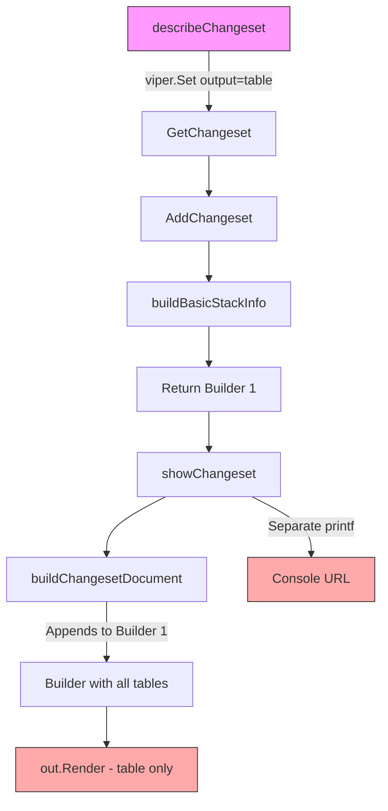
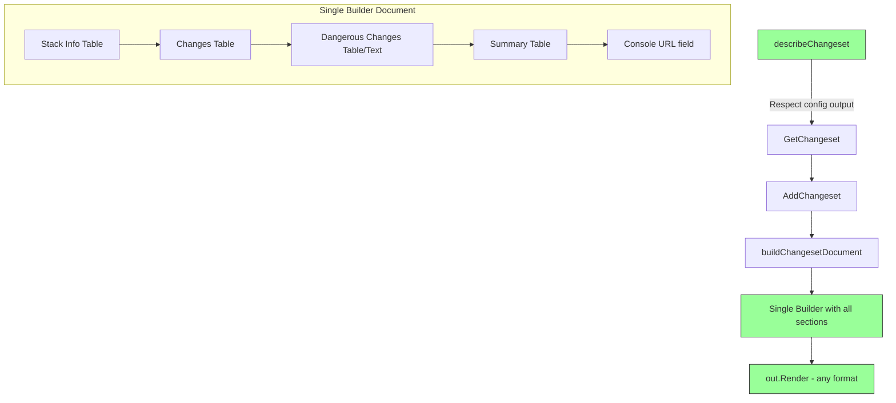
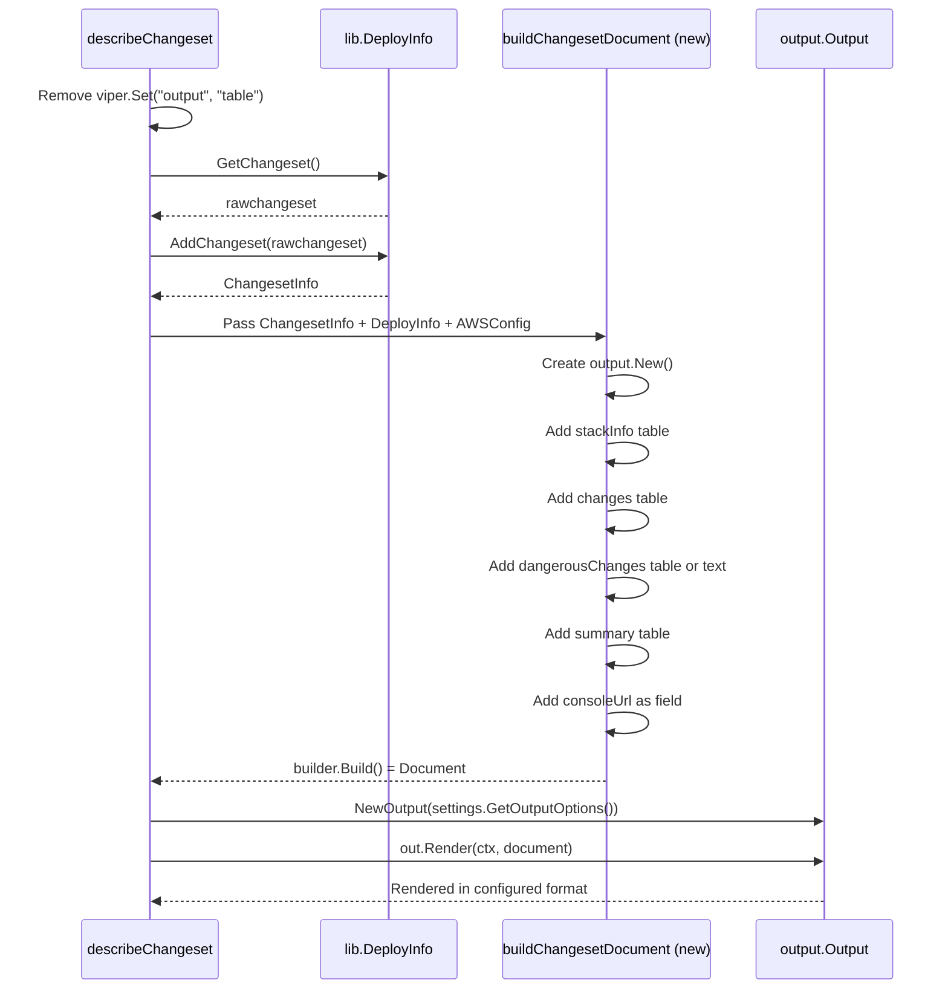

# Design Document: Changeset Output Format Support

## Overview

This design implements configurable output formats for the `describe changeset` command by removing the hardcoded table enforcement and restructuring the output generation to use a single go-output v2 Builder document. The implementation ensures all changeset information (stack info, changes, dangerous changes, summary, console URL) is captured in a unified document that can be rendered in any supported format (table, csv, json, yaml, markdown, html).

### Key Design Principles

1. **Single Document Pattern**: All output components flow through one Builder document for consistent formatting
2. **Format-Agnostic Data**: Store data without formatting codes; apply styling during rendering
3. **Minimal Changes**: Leverage existing functions where possible, refactor only what's necessary
4. **Backward Compatibility**: Table output maintains exact current appearance and behavior

### Scope

**In Scope**:
- Remove `viper.Set("output", "table")` enforcement in `cmd/describe_changeset.go`
- Restructure output to use single Builder document
- Support all fog formats: table, csv, json, yaml, markdown, html
- Include console URL in structured output (currently separate printf)
- Handle empty changesets appropriately for each format

**Out of Scope**:
- Deploy command changeset display (separate future spec)
- Configuration precedence logic (already handled by viper/cobra)
- Performance optimization beyond current implementation
- New changeset features or data sources

## Architecture

### Current Implementation Flow



**Problems**:
- Line 56: Hardcoded `viper.Set("output", "table")` prevents other formats
- Line 164: Console URL printed via `fmt.Printf`, outside Builder pattern
- Multiple render calls (lines 128, 150, 157, 273) instead of single document render

### Proposed Implementation Flow



**Benefits**:
- Single render call with complete document
- Format-agnostic structure
- Console URL included in structured output
- Transformers (ANSI stripping, emoji handling) apply consistently

### Data Flow Transformation



## Components and Interfaces

### 1. Command Layer Changes

**File**: `cmd/describe_changeset.go`

#### Current Function: `describeChangeset()` (lines 55-84)

**Changes**:
1. **Remove line 56**: `viper.Set("output", "table")` enforcement
2. **Replace lines 82-83**: Instead of calling `showChangeset()`, call new `buildAndRenderChangeset()`

```go
// Before (lines 82-83):
builder := buildBasicStackInfo(deployment, false, awsConfig)
showChangeset(changeset, deployment, awsConfig, builder)

// After:
buildAndRenderChangeset(changeset, deployment, awsConfig)
```

#### New Function: `buildAndRenderChangeset()`

```go
// buildAndRenderChangeset creates a complete changeset document and renders it
func buildAndRenderChangeset(
    changeset lib.ChangesetInfo,
    deployment lib.DeployInfo,
    awsConfig config.AWSConfig,
) {
    // Create single builder for entire document
    builder := output.New()

    // Add stack information section (includes console URL)
    builder = addStackInfoSection(builder, deployment, awsConfig, changeset, false)

    // Add changeset sections (changes, dangerous changes, summary)
    builder = addChangesetSections(builder, changeset)

    // Build and render the complete document
    doc := builder.Build()
    out := output.NewOutput(settings.GetOutputOptions()...)
    if err := out.Render(context.Background(), doc); err != nil {
        fmt.Printf("ERROR: Failed to render changeset: %v\n", err)
        os.Exit(1)
    }
}
```

#### Refactored Function: `buildBasicStackInfo()` → `addStackInfoSection()`

**Changes**:
1. Accept builder as parameter instead of creating new one
2. Return builder after adding content (fluent interface)
3. Rename for clarity about what it does

```go
// addStackInfoSection adds stack information table to the builder
func addStackInfoSection(
    builder *output.Builder,
    deployment lib.DeployInfo,
    awsConfig config.AWSConfig,
    changeset lib.ChangesetInfo,
    showDryRunInfo bool,
) *output.Builder {
    stacktitle := "CloudFormation stack information"
    keys := []string{"StackName", "Account", "Region", "Action"}
    if showDryRunInfo {
        keys = append(keys, "Is dry run")
    }
    // Add Console URL column if not a dry run
    if !deployment.IsDryRun {
        keys = append(keys, "ConsoleURL")
    }

    content := make(map[string]any)
    content["StackName"] = deployment.GetCleanedStackName()
    content["Account"] = awsConfig.GetAccountAliasID()
    content["Region"] = awsConfig.Region
    action := "Update"
    if deployment.IsNew {
        action = "Create"
    }
    content["Action"] = action
    if showDryRunInfo {
        dryRunValue := "❌"
        if deployment.IsDryRun {
            dryRunValue = "✅"
        }
        content["Is dry run"] = dryRunValue
    }
    // Add console URL as a field for programmatic access
    if !deployment.IsDryRun {
        content["ConsoleURL"] = changeset.GenerateChangesetUrl(awsConfig)
    }

    // Add table to existing builder
    return builder.Table(
        stacktitle,
        []map[string]any{content},
        output.WithKeys(keys...),
    )
}
```

#### Refactored Function: `buildChangesetDocument()` → `addChangesetSections()`

**Current Issues**:
- Returns `(*output.Builder, bool)` but creates a new builder if none provided
- Mixes data preparation with builder construction
- Has optional builder parameter (confusing interface)

**New Approach**:
1. Always accept builder as parameter (no optional parameters)
2. Return builder after adding sections (fluent interface)
3. Add console URL to the document structure
4. Handle empty changesets with appropriate format-specific content

```go
// addChangesetSections adds changeset tables to the builder
// Console URL is handled in addStackInfoSection as a table field
func addChangesetSections(
    builder *output.Builder,
    changeset lib.ChangesetInfo,
) *output.Builder {
    changesettitle := fmt.Sprintf("%v %v", texts.DeployChangesetMessageChanges, changeset.Name)
    changesetsummarytitle := fmt.Sprintf("Summary for %v", changeset.Name)

    // Handle empty changeset case
    if len(changeset.Changes) == 0 {
        // Add appropriate empty message as text for human-readable formats
        // This will appear in table/markdown/html but be handled appropriately in JSON/YAML/CSV
        builder = builder.Text(texts.DeployChangesetMessageNoResourceChanges + "\n")
        return builder
    }

    // Build changes table data
    changeRows, summaryContent, dangerRows := buildChangesetData(changeset.Changes, changeset.HasModule)

    // Add changes table
    changesetkeys := []string{"Action", "CfnName", "Type", "ID", "Replacement"}
    if changeset.HasModule {
        changesetkeys = append(changesetkeys, "Module")
    }
    builder = builder.Table(
        changesettitle,
        changeRows,
        output.WithKeys(changesetkeys...),
    )

    // Add dangerous changes section
    if len(dangerRows) == 0 {
        // Use empty table instead of text message
        // Go-output v2 will handle this appropriately per format:
        // - Table: shows title with no rows (acceptable)
        // - JSON/YAML: includes table with empty data array
        // - CSV: no rows for this section
        builder = builder.Table(
            "Potentially destructive changes",
            []map[string]any{},
            output.WithKeys("Action", "CfnName", "Type", "ID", "Replacement", "Details"),
        )
    } else {
        dangerKeys := []string{"Action", "CfnName", "Type", "ID", "Replacement", "Details"}
        if changeset.HasModule {
            dangerKeys = append(dangerKeys, "Module")
        }
        builder = builder.Table(
            "Potentially destructive changes",
            dangerRows,
            output.WithKeys(dangerKeys...),
        )
    }

    // Add summary table
    summarykeys, _ := getChangesetSummaryTable()
    builder = builder.Table(
        changesetsummarytitle,
        []map[string]any{summaryContent},
        output.WithKeys(summarykeys...),
    )

    return builder
}
```

#### New Helper Function: `buildChangesetData()`

Extract data preparation logic from mixed builder/data code:

```go
// buildChangesetData prepares changeset data for rendering
// Returns: (changeRows, summaryContent, dangerRows)
func buildChangesetData(
    changes []lib.ChangesetChanges,
    hasModule bool,
) ([]map[string]any, map[string]any, []map[string]any) {
    bold := color.New(color.Bold).SprintFunc()

    // Initialize summary
    summarykeys, summaryContent := getChangesetSummaryTable()

    // Build change rows
    changeRows := make([]map[string]any, 0, len(changes))
    dangerRows := make([]map[string]any, 0)

    for _, change := range changes {
        // Build change row
        changeContent := make(map[string]any)
        action := change.Action
        if action == eventTypeRemove {
            action = bold(action)
        }
        changeContent["Action"] = action
        changeContent["Replacement"] = change.Replacement
        changeContent["CfnName"] = change.LogicalID
        changeContent["Type"] = change.Type
        changeContent["ID"] = change.ResourceID
        if hasModule {
            changeContent["Module"] = change.Module
        }
        changeRows = append(changeRows, changeContent)

        // Update summary
        addToChangesetSummary(&summaryContent, change)

        // Add to danger rows if dangerous
        if change.Action == "Remove" ||
           change.Replacement == "Conditional" ||
           change.Replacement == "True" {
            dangerContent := make(map[string]any)
            dangerContent["Action"] = action  // Already bolded if Remove
            dangerContent["Replacement"] = change.Replacement
            dangerContent["CfnName"] = change.LogicalID
            dangerContent["Type"] = change.Type
            dangerContent["ID"] = change.ResourceID
            dangerContent["Details"] = change.GetDangerDetails()
            if hasModule {
                dangerContent["Module"] = change.Module
            }
            dangerRows = append(dangerRows, dangerContent)
        }
    }

    return changeRows, summaryContent, dangerRows
}
```

### 2. Shared Functions (MUST be preserved)

These functions are used by other commands and **MUST NOT be removed**:

1. **`showChangeset()`** (lines 133-166): Used by **deploy_helpers.go** (line 128)
2. **`buildChangesetDocument()`** (lines 168-258): Used by **history.go** (line 145)
3. **`printBasicStackInfo()`** (lines 122-131): Used by **deploy.go** (line 109)

**Strategy**: Keep these functions unchanged. The `describe changeset` command will use new functions (`buildAndRenderChangeset()`, `addChangesetSections()`, `addStackInfoSection()`), but the existing functions remain for other commands.

### 3. Deprecated Functions (can be removed)

Only this function can be safely removed as it's only used within describe_changeset.go:

1. **`printChangeset()`** (lines 260-277): Only used internally in describe_changeset.go, replaced by new implementation

### 3. Data Structure Output

The go-output v2 library handles format conversion automatically based on the document structure. The structured output will be:

#### JSON/YAML Structure

```json
{
  "tables": [
    {
      "title": "CloudFormation stack information",
      "data": [
        {
          "StackName": "my-stack",
          "Account": "123456789012 (my-account)",
          "Region": "us-east-1",
          "Action": "Update",
          "ConsoleURL": "https://console.aws.amazon.com/cloudformation/home?region=us-east-1#/stacks/changesets/changes?stackId=..."
        }
      ]
    },
    {
      "title": "Changes for changeset-name",
      "data": [
        {
          "Action": "Add",
          "CfnName": "MyBucket",
          "Type": "AWS::S3::Bucket",
          "ID": "my-bucket-abc123",
          "Replacement": "False"
        }
      ]
    },
    {
      "title": "Potentially destructive changes",
      "data": []
    },
    {
      "title": "Summary for changeset-name",
      "data": [
        {
          "Total": 5,
          "Added": 2,
          "Removed": 1,
          "Modified": 2,
          "Replacements": 0,
          "Conditionals": 1
        }
      ]
    }
  ]
}
```

**Note**: The go-output v2 library's default JSON structure wraps all `builder.Table()` calls in a `tables` array. This is the standard structure across all fog commands using go-output v2 and provides consistent programmatic access - consumers can iterate the `tables` array and index by title or position.

#### CSV Structure

Go-output v2 renders multiple `builder.Table()` calls as separate CSV sections with headers between them:

```csv
CloudFormation stack information
StackName,Account,Region,Action,ConsoleURL
my-stack,123456789012 (my-account),us-east-1,Update,https://console.aws.amazon.com/...

Changes for changeset-name
Action,CfnName,Type,ID,Replacement
Add,MyBucket,AWS::S3::Bucket,my-bucket-abc123,False
Modify,MyLambda,AWS::Lambda::Function,my-function,False

Potentially destructive changes
Action,CfnName,Type,ID,Replacement,Details

Summary for changeset-name
Total,Added,Removed,Modified,Replacements,Conditionals
2,1,0,1,0,0
```

**Note**: The go-output v2 library handles CSV rendering automatically. Each table becomes a separate section with its title and headers. Empty tables (like "Potentially destructive changes" above) show headers only with no data rows. This multi-section format is consistent with other fog commands and provides clear separation of concerns for CSV consumers.

## Error Handling

### Error Scenarios

1. **Unsupported Format**: Already handled by viper/cobra flag validation
2. **Rendering Failure**: Handle at render call site with clear error message
3. **Changeset Retrieval Failure**: Existing error handling (lines 76-80)
4. **Empty Changeset**: Handled with appropriate format-specific content

### Implementation

```go
// Error handling in buildAndRenderChangeset
func buildAndRenderChangeset(...) {
    // ... build document ...

    doc := builder.Build()
    out := output.NewOutput(settings.GetOutputOptions()...)
    if err := out.Render(context.Background(), doc); err != nil {
        fmt.Printf("ERROR: Failed to render changeset output: %v\n", err)
        os.Exit(1)
    }
}
```

### Exit Codes

- `0`: Successful render of changeset (even if empty)
- `1`: Rendering failure, changeset retrieval failure, or invalid parameters

## Testing Strategy

### Unit Tests

**File**: `cmd/describe_changeset_test.go`

#### Test Coverage Requirements

1. **Format Support Tests**: Verify all formats render without error
   - Test with sample changeset data for: table, csv, json, yaml, markdown, html
   - Verify output structure matches expected format

2. **Empty Changeset Tests**: Verify empty changeset handling
   - Test each format with zero changes
   - Verify appropriate empty indicators

3. **Console URL Tests**: Verify URL inclusion
   - Test that URL appears as a field in stack info table
   - Test that URL is present in all formats (table column, JSON field, CSV column)
   - Test that URL is omitted for dry runs

4. **Data Structure Tests**: Verify output completeness
   - Test that all sections present (stack info, changes, dangerous changes, summary)
   - Test module column appears only when needed
   - Test bold formatting applied to Remove actions (for table format)

5. **ANSI Code Tests**: Verify clean structured output
   - Test that JSON output contains no ANSI escape sequences
   - Test that YAML output contains no ANSI escape sequences
   - Test that CSV output contains no ANSI escape sequences
   - Verify that table output DOES contain ANSI codes for colors

6. **JSON Structure Tests**: Verify go-output v2 structure
   - Test that JSON has `tables` array as top-level key
   - Test that each table has `title` and `data` fields
   - Test that console URL is accessible via `tables[0].data[0].ConsoleURL`

#### Test Implementation Pattern

Following fog's existing test patterns:

```go
func TestDescribeChangeset_OutputFormats(t *testing.T) {
    tests := map[string]struct {
        format         string
        changes        []lib.ChangesetChanges
        hasModule      bool
        expectError    bool
        validateOutput func(t *testing.T, output string)
    }{
        "table format with changes": {
            format: "table",
            changes: []lib.ChangesetChanges{
                {Action: "Add", LogicalID: "MyBucket", Type: "AWS::S3::Bucket"},
            },
            hasModule: false,
            expectError: false,
            validateOutput: func(t *testing.T, output string) {
                assert.Contains(t, output, "MyBucket")
                assert.Contains(t, output, "Add")
            },
        },
        "json format with changes": {
            format: "json",
            changes: []lib.ChangesetChanges{
                {Action: "Add", LogicalID: "MyBucket", Type: "AWS::S3::Bucket"},
            },
            hasModule: false,
            expectError: false,
            validateOutput: func(t *testing.T, output string) {
                var result map[string]any
                err := json.Unmarshal([]byte(output), &result)
                assert.NoError(t, err)
                assert.Contains(t, result, "tables")
            },
        },
        "empty changeset table format": {
            format: "table",
            changes: []lib.ChangesetChanges{},
            hasModule: false,
            expectError: false,
            validateOutput: func(t *testing.T, output string) {
                assert.Contains(t, output, "No resource changes")
            },
        },
    }

    for name, tc := range tests {
        t.Run(name, func(t *testing.T) {
            // Set output format
            viper.Set("output", tc.format)

            // Create test changeset
            changeset := createTestChangeset(tc.changes, tc.hasModule)
            deployment := createTestDeployment()
            awsConfig := createTestAWSConfig()

            // Capture output
            output := captureOutput(func() {
                buildAndRenderChangeset(changeset, deployment, awsConfig)
            })

            // Validate
            if tc.validateOutput != nil {
                tc.validateOutput(t, output)
            }
        })
    }
}
```

### Integration Tests

**File**: `cmd/describe_changeset_integration_test.go`

Tests full command execution with mocked AWS clients:

```go
//go:build integration
// +build integration

func TestDescribeChangesetCommand_Integration(t *testing.T) {
    tests := map[string]struct {
        format       string
        setupMock    func(*testutil.MockCloudFormationClient)
        expectedExit int
    }{
        "successful changeset retrieval json format": {
            format: "json",
            setupMock: func(mock *testutil.MockCloudFormationClient) {
                mock.DescribeChangeSetResponse = testutil.NewChangeSetBuilder().
                    WithChanges(2).
                    Build()
            },
            expectedExit: 0,
        },
    }

    for name, tc := range tests {
        t.Run(name, func(t *testing.T) {
            // Setup test environment
            mockClient := testutil.NewMockCloudFormationClient()
            tc.setupMock(mockClient)

            // Execute command
            cmd := rootCmd
            cmd.SetArgs([]string{
                "describe", "changeset",
                "--stackname", "test-stack",
                "--changeset", "test-changeset",
                "--output", tc.format,
            })

            err := cmd.Execute()
            if tc.expectedExit == 0 {
                assert.NoError(t, err)
            } else {
                assert.Error(t, err)
            }
        })
    }
}
```

### Test Data

Use existing test fixtures from `lib/testutil/fixtures.go`:
- `NewChangeSetBuilder()`: Create test changesets
- `NewStackBuilder()`: Create test stacks
- Mock AWS clients from `lib/testutil/`

## Implementation Checklist

### Phase 1: Refactor Output Functions
- [ ] Create `addStackInfoSection()` from `buildBasicStackInfo()` (includes console URL as field)
- [ ] Create `buildChangesetData()` helper for data preparation
- [ ] Create `addChangesetSections()` from `buildChangesetDocument()` (use empty table for no dangerous changes)
- [ ] Update existing tests to use new functions

### Phase 2: Update Command Function
- [ ] Remove `viper.Set("output", "table")` from `describeChangeset()`
- [ ] Create `buildAndRenderChangeset()` function
- [ ] Update `describeChangeset()` to call new function
- [ ] Test with table format (verify backward compatibility)

### Phase 3: Testing
- [ ] Add unit tests for all output formats
- [ ] Add tests for empty changesets
- [ ] Add tests for console URL inclusion (verify as table field)
- [ ] Add ANSI code stripping tests (verify clean JSON/YAML/CSV output)
- [ ] Add JSON structure tests (verify `tables` array structure)
- [ ] Add integration tests
- [ ] Verify golden file tests if they exist

### Phase 4: Cleanup
- [ ] Remove ONLY `printChangeset()` function (the only truly deprecated function)
- [ ] Keep `showChangeset()`, `buildChangesetDocument()`, `printBasicStackInfo()` as they're used by deploy and history commands
- [ ] Remove unused imports
- [ ] Run `go fmt`
- [ ] Run `golangci-lint`
- [ ] Update CHANGELOG.md

## Migration Path

The implementation can be done incrementally:

1. **Step 1**: Create new functions alongside old ones
2. **Step 2**: Update `describeChangeset()` to use new functions
3. **Step 3**: Verify all tests pass with table format
4. **Step 4**: Test additional formats
5. **Step 5**: Remove old functions

This approach allows rollback at any step if issues are discovered.

## Open Questions

None. All requirements are clear and implementation approach is validated against existing fog patterns.

## References

- Go-Output v2 Documentation: [go-output GitHub](https://github.com/ArjenSchwarz/go-output)
- Go-Output v2 Migration Design: `specs/go-output-v2/design.md`
- Existing Patterns:
  - Report command: `cmd/report.go` (lines 152-186) - multiple sections in one document
  - Drift command: `cmd/drift.go` (lines 189-215) - conditional content rendering
  - Deploy command: `cmd/deploy_helpers.go` (line 173) - Builder pattern usage
