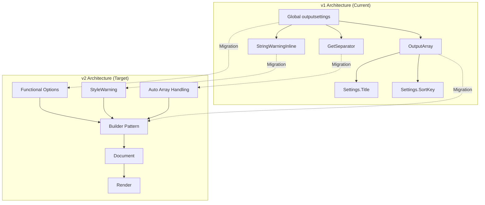
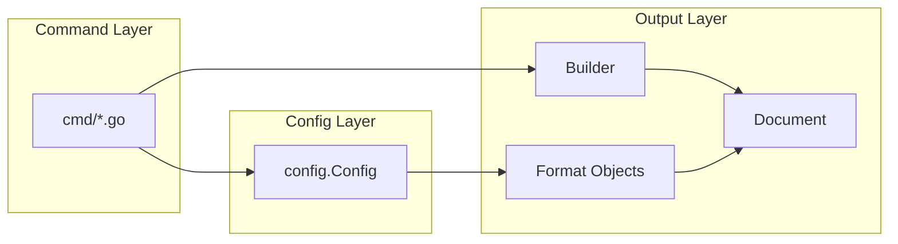
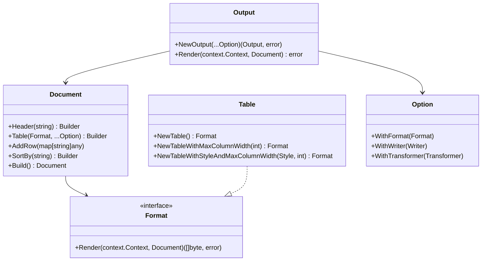
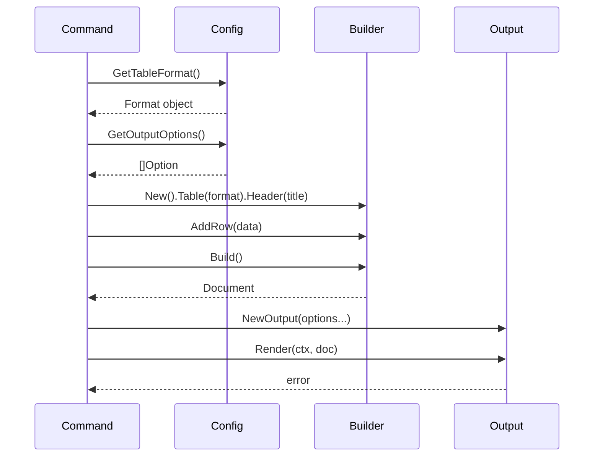

# Design Document: Go-Output v2 Migration

## Overview

### Purpose
This document describes the technical design for migrating fog from go-output v1.5.1 to v2.2.1+. The migration replaces global state-based patterns with v2's Builder pattern and functional options while maintaining complete backward compatibility for CLI users.

### Scope
- All commands using output formatting (deploy, drift, report, exports, dependencies, history, etc.)
- Configuration layer (config/config.go)
- Global outputsettings variable elimination (cmd/root.go)
- Output construction patterns across 64 OutputArray usages in 14 files

### Goals
1. Eliminate global state (`var outputsettings *format.OutputSettings`)
2. Adopt v2's Builder pattern for document construction
3. Use functional options for configuration
4. Leverage v2.2.1 features (inline styling, column width, array handling)
5. Maintain CLI backward compatibility (flags, config keys, output appearance)

### Non-Goals
- Changing CLI flags or configuration file keys
- Modifying user-facing output formats
- Implementing new features beyond v1 parity
- Performance optimization beyond what v2 provides naturally

## Architecture

### High-Level Transformation



### Layer Architecture



## Components and Interfaces

### 1. Configuration Layer

**File**: `config/config.go`

**Current Implementation**:
```go
func (config *Config) NewOutputSettings() *format.OutputSettings {
    settings := format.NewOutputSettings()
    settings.UseEmoji = true
    settings.UseColors = true
    settings.SetOutputFormat(config.GetLCString("output"))
    settings.OutputFile = config.GetLCString("output-file")
    settings.OutputFileFormat = config.GetLCString("output-file-format")
    settings.TableStyle = format.TableStyles[config.GetString("table.style")]
    settings.TableMaxColumnWidth = config.GetInt("table.max-column-width")
    return settings
}
```

**New Implementation Design**:
```go
// GetTableFormat creates a v2 Format object for table output
func (config *Config) GetTableFormat() output.Format {
    maxWidth := config.GetInt("table.max-column-width")
    styleName := config.GetString("table.style")

    // Map v1 style names to v2 table styles
    var style table.Style
    switch styleName {
    case "Bold":
        style = table.StyleBold
    case "ColoredBright":
        style = table.StyleColoredBright
    default:
        style = table.StyleDefault
    }

    return table.NewTableWithStyleAndMaxColumnWidth(style, maxWidth)
}

// GetOutputOptions creates v2 functional options from config
func (config *Config) GetOutputOptions() []output.Option {
    opts := []output.Option{}

    // Console output
    consoleFormat := config.getFormatForOutput(config.GetLCString("output"))
    opts = append(opts, output.WithFormat(consoleFormat))
    opts = append(opts, output.WithWriter(output.NewStdoutWriter()))

    // File output if configured
    if outputFile := config.GetLCString("output-file"); outputFile != "" {
        fileFormat := config.getFormatForOutput(config.GetLCString("output-file-format"))
        dir, pattern := filepath.Split(outputFile)
        opts = append(opts, output.WithFormat(fileFormat))
        opts = append(opts, output.WithWriter(output.NewFileWriter(dir, pattern)))
    }

    // Transformers
    if config.GetBool("use-emoji") {
        opts = append(opts, output.WithTransformer(&output.EmojiTransformer{}))
    }
    if config.GetBool("use-colors") {
        opts = append(opts, output.WithTransformer(&output.ColorTransformer{}))
    }

    return opts
}

// getFormatForOutput maps format name to v2 Format object
func (config *Config) getFormatForOutput(formatName string) output.Format {
    switch formatName {
    case "csv":
        return csv.NewCSV()
    case "json":
        return json.NewJSON()
    case "dot":
        return dot.NewDot()
    default:
        return config.GetTableFormat()
    }
}
```

### 2. Command Layer Pattern

**Migration Pattern for Commands**:

**Before (v1)**:
```go
// cmd/exports.go:75-77
output := format.OutputArray{
    Keys: keys,
    Settings: settings.NewOutputSettings(),
}
output.Settings.Title = title
output.Settings.SortKey = "Export"

// Add rows...
for _, export := range exports {
    output.AddRow(map[string]string{
        "Export": export.Name,
        "Value": strings.Join(export.ImportingStacks, settings.GetSeparator()),
    })
}

output.Write()
```

**After (v2)**:
```go
// cmd/exports.go (updated)
doc := output.New().
    Header(title).
    Table(
        settings.GetTableFormat(),
        output.WithKeys("Export", "Value"),
    )

// Add rows...
for _, export := range exports {
    doc.AddRow(map[string]any{
        "Export": export.Name,
        "Value": export.ImportingStacks, // v2 handles array automatically
    })
}

out, err := output.NewOutput(settings.GetOutputOptions()...)
if err != nil {
    return err
}
err = out.Render(context.Background(), doc.Build())
```

### 3. Inline Styling Migration

**File**: Multiple command files (drift.go, deploy.go, etc.)

**Before (v1)**:
```go
// cmd/drift.go:121
changetype = outputsettings.StringWarningInline(changetype)

// cmd/drift.go:220
properties = append(properties, outputsettings.StringWarningInline(fmt.Sprintf("DELETED: %s", property)))

// cmd/drift.go:287
properties = append(properties, outputsettings.StringPositiveInline(fmt.Sprintf("- %s: %s", property, actual)))
```

**After (v2)**:
```go
// cmd/drift.go (updated)
changetype = output.StyleWarning(changetype)

properties = append(properties, output.StyleWarning(fmt.Sprintf("DELETED: %s", property)))

properties = append(properties, output.StylePositive(fmt.Sprintf("- %s: %s", property, actual)))
```

**Conditional Styling Pattern**:
```go
// When styling depends on condition
status := output.StyleWarningIf(isDrift, "DRIFTED", "IN SYNC")
```

### 4. Multiple Table Support

**File**: Commands with complex output (deploy.go)

**Pattern**:
```go
doc := output.New()

// First table
doc.Table(
    settings.GetTableFormat(),
    output.WithKeys("Resource", "Status", "Reason"),
)
for _, event := range events {
    doc.AddRow(eventToRow(event))
}

// Second table (different columns)
doc.Table(
    settings.GetTableFormat(),
    output.WithKeys("Output", "Value", "Export"),
)
for _, out := range outputs {
    doc.AddRow(outputToRow(out))
}

// Render both tables
out, err := output.NewOutput(settings.GetOutputOptions()...)
if err != nil {
    return err
}
err = out.Render(context.Background(), doc.Build())
```

### 5. Sorting Implementation

**Before (v1)**:
```go
output.Settings.SortKey = "Export"
```

**After (v2)**:
```go
doc := output.New().
    Table(
        settings.GetTableFormat(),
        output.WithKeys("Export", "Value"),
    ).
    SortBy("Export") // Data pipeline method
```

### 6. Global State Elimination

**File**: `cmd/root.go`

**Current**:
```go
// Line 35
var outputsettings *format.OutputSettings

// Line 187
outputsettings = settings.NewOutputSettings()
```

**New**:
```go
// Remove global variable entirely
// Pass config.Config to commands instead
// Each command gets fresh options via settings.GetOutputOptions()
```

**Command Signature Update**:
```go
// Before
func runExports(cmd *cobra.Command, args []string) error {
    // Uses global outputsettings
}

// After
func runExports(cmd *cobra.Command, args []string) error {
    // Get config from context or command
    settings := getConfig(cmd)
    // Use settings.GetOutputOptions() when rendering
}
```

## Data Models

### Document Structure



### Configuration Data Flow



## Error Handling

### Context Usage

All `Render()` calls use `context.Background()`:
```go
err := out.Render(context.Background(), doc.Build())
if err != nil {
    return fmt.Errorf("failed to render output: %w", err)
}
```

### Configuration Errors

```go
out, err := output.NewOutput(settings.GetOutputOptions()...)
if err != nil {
    return fmt.Errorf("failed to create output: %w", err)
}
```

### File Output Errors

v2's `NewFileWriter()` handles directory creation automatically. Errors are returned during `Render()`:
```go
// No explicit error handling needed for directory creation
writer := output.NewFileWriter(dir, pattern)

// Errors surface during render
err := out.Render(ctx, doc)
if err != nil {
    return fmt.Errorf("failed to write output file: %w", err)
}
```

## Testing Strategy

### Manual Validation Approach

Per Decision Log #1, the migration will use manual validation rather than automated golden file testing initially. However, minimal automated testing will be added to catch gross regressions.

**Testing Process**:

1. **Unit Tests**: Existing unit tests must pass after migration
2. **Integration Tests**: Existing integration tests must pass after migration
3. **Golden File Tests**: Add 4 minimal golden file tests (one per format: table, csv, json, dot) for the exports command to catch obvious regressions
4. **Manual Verification**: Developer validates output for each command using acceptance criteria defined below

**Platform Testing** (Requirement 12.7):
- Windows: Verify compilation succeeds and `fog --version` executes (v2 resolves v1 Windows bug)
- macOS: Full manual testing across all commands
- Linux: CI/CD validation

**Functional Equivalence Criteria**:

"Functionally equivalent" means:
- Same data in same columns
- Same row count
- Same data types (strings, numbers, arrays)
- Styling intent preserved (warnings red, positives green)
- Column width wrapping occurs near same boundaries (exact character match not required)
- Arrays render with appropriate separators for the format

**Specific Test Cases**:

1. **Column Ordering** (NEW - addresses peer review concern)
   - For each command, verify column order matches v1 output
   - Document expected order: exports ("Export", "Value"), dependencies ("Name", "DependedOnBy"), etc.
   - Test by comparing first row headers between v1 and v2

2. **Inline Styling** (Requirement 12.4)
   - Run `fog drift` and verify warning/positive colors appear correctly
   - Compare side-by-side with v1 output for visual parity
   - Validate ANSI codes present in terminal output

3. **Column Width** (Requirement 12.5)
   - Run commands with long cell content
   - Verify text wraps at configured width (default 50)
   - Test with custom `table.max-column-width` setting
   - Wrapping may occur at word boundaries (minor difference from v1 acceptable)

4. **File Output** (Requirement 12.6)
   - Test `--file` and `--file-format` flags
   - Verify files created in correct locations
   - Verify parent directories created automatically
   - Test simultaneous console and file output

5. **Array Handling** (NEW - addresses peer review concern)
   - Test exports command with multiple importing stacks
   - Document v2 array separators:
     - Table format: newlines (vertical layout within cell)
     - CSV format: semicolons (`;`)
     - JSON format: native arrays (`["item1", "item2"]`)
     - Markdown format: `<br/>` tags
   - Verify output matches these separator patterns
   - Compare equivalence with v1 GetSeparator() output

6. **Multiple Tables** (Requirement 9.4)
   - Test deploy command with events + outputs tables
   - Verify both tables render correctly in all formats
   - Verify tables are separated appropriately

7. **Sorting** (Requirement 8.5)
   - Test commands with SortKey configuration
   - Verify table rows sorted correctly by configured key

### Linting and Formatting

```bash
# Must pass after all changes
go fmt ./...
golangci-lint run
go test ./...
INTEGRATION=1 go test ./...
```

## Migration Implementation Plan

### Phase 1: Configuration Layer
1. Add new methods to `config/config.go`:
   - `GetTableFormat()`
   - `GetOutputOptions()`
   - `getFormatForOutput()`
2. Keep `NewOutputSettings()` temporarily for backward compatibility
3. Update import paths to `github.com/ArjenSchwarz/go-output/v2`

### Phase 2: Inline Styling
1. Global find-replace:
   - `outputsettings.StringWarningInline()` → `output.StyleWarning()`
   - `outputsettings.StringPositiveInline()` → `output.StylePositive()`
   - `outputsettings.StringNegativeInline()` → `output.StyleNegative()`
2. Update imports to include `output` package
3. Remove `outputsettings` variable references from styling calls

### Phase 3: Command Migration
1. Update commands in order of complexity (simple → complex):
   - exports.go (simple single table)
   - dependencies.go (single table with sorting)
   - drift.go (complex multiple tables with styling)
   - deploy.go (multiple tables)
2. For each command:
   - Replace `OutputArray` with Builder pattern
   - Use `settings.GetTableFormat()`
   - Use `settings.GetOutputOptions()`
   - Call `Render(context.Background(), doc.Build())`

### Phase 4: Global State Removal
1. Remove `var outputsettings *format.OutputSettings` from root.go
2. Remove initialization in root command
3. Verify no references remain
4. Remove `NewOutputSettings()` from config package

### Phase 5: Testing and Validation
1. Run `go test ./...`
2. Run `INTEGRATION=1 go test ./...`
3. Manual testing of all commands
4. Platform testing (Windows, macOS, Linux)
5. Update CHANGELOG.md

### Phase 6: Cleanup
1. Remove v1 dependency from go.mod
2. Run `go mod tidy`
3. Final linting pass
4. Update documentation if needed

## Backward Compatibility

### CLI Flags (Unchanged)
- `--output` / `-o`
- `--file`
- `--file-format`
- All command-specific flags

### Configuration Keys (Unchanged)
- `table.style`
- `table.max-column-width`
- `output`
- `output-file`
- `output-file-format`

### Output Appearance (Functionally Equivalent)
- Table format: Same columns, same styling intent, same width behavior
- CSV format: Same escaping, format-appropriate array separators
- JSON format: Same structure
- Dot format: Same graph structure

### Default Values (Unchanged)
- `table.style`: "Default"
- `table.max-column-width`: 50

## Risks and Mitigations

| Risk | Impact | Mitigation |
|------|--------|------------|
| Output appearance changes noticed by users | Medium | Manual validation before release; functional equivalence acceptable per Decision Log #1 |
| Array handling differences in edge cases | Low | Keep GetSeparator() available; migrate arrays incrementally |
| File output path handling differences | Low | Test file output explicitly; v2 handles directory creation |
| Windows-specific issues | Low | v2 resolves v1 Windows bug; validate with existing CI/CD |
| Performance regression | Low | v2 performance equivalent or better; CloudFormation API time dominates |

## Rollback Strategy

Per Decision Log #2: Standard git practices sufficient.

**Emergency Rollback**:
```bash
# Option 1: Revert commit
git revert <migration-commit>

# Option 2: Pin to v1 in go.mod
go get github.com/ArjenSchwarz/go-output@v1.5.1
go mod tidy
```

**Fix-Forward Preferred**: Address issues through normal bug fix process rather than rollback.

## API Validation

This section addresses concerns raised during design review about whether v2's API supports the patterns shown in this design.

### Verified API Methods

All methods used in this design have been verified against v2.2.1 API documentation:

1. **Builder Pattern** (API.md:217-231)
   - `output.New()` creates Builder
   - `Builder.Table(title, data, opts)` adds tables
   - `Builder.Header(text)` adds headers
   - `Builder.Build()` returns Document
   - ✅ Confirmed in API.md

2. **Table Configuration** (API.md:890-894)
   - `TableWithMaxColumnWidth(int)` creates Format with width limit
   - `TableWithStyleAndMaxColumnWidth(string, int)` creates Format with both
   - ✅ Confirmed in API.md lines 890-894, 912, 919, 944

3. **Inline Styling** (API.md:1645-1658)
   - `StyleWarning(text string) string` - Red bold text
   - `StylePositive(text string) string` - Green bold text
   - `StyleNegative(text string) string` - Red text
   - `StyleWarningIf(condition bool, text string) string` - Conditional styling
   - `StylePositiveIf(condition bool, text string) string` - Conditional styling
   - ✅ Confirmed in API.md lines 1647-1658 with examples at 1668-1691

4. **Output Options** (API.md:820-841)
   - `WithFormat(format Format)` sets output format
   - `WithFormats(formats ...Format)` sets multiple formats (verified at line 110, 160, 779, 1471)
   - `WithWriter(writer Writer)` sets output destination
   - `WithWriters(writers ...Writer)` sets multiple writers (verified at line 827)
   - `WithTransformer(transformer Transformer)` adds byte transformer
   - ✅ Confirmed in API.md

5. **Array Handling** (API.md:1705-1809)
   - Table format: newlines within cells (verified line 1740-1750)
   - Markdown format: `<br/>` tags (verified line 1763-1770)
   - CSV format: semicolons (verified line 1808)
   - JSON format: native arrays (verified line 1785-1794)
   - ✅ Confirmed in API.md with explicit examples

6. **Data Pipeline** (API.md:1090-1526)
   - `doc.Pipeline().SortBy(key, direction).Execute()` for sorting
   - ✅ Confirmed as preferred method over byte transformers

### Multiple Format/Writer Clarification

Design-critic questioned whether multiple `WithFormat()` and `WithWriter()` calls work in a single Output instance.

**Answer**: Yes, confirmed by API.md:
- Line 110-113: Example showing `WithFormats(JSON, CSV, Markdown)` with multiple writers
- Line 779: Another example with `WithFormats(Markdown, JSON, Table)`
- Line 1840-1847: Example showing multiple formats and writers simultaneously
- All examples use plural `WithFormats()` and `WithWriters()` which accept variadic arguments

### Table Style Mapping

Design shows mapping v1 style names to v2 styles. Verification:

**v1 Styles in Current Code** (cmd/root.go:105):
```go
viper.SetDefault("table.style", "Default")
```

**v2 Table Styles** (API.md:874-881):
```go
var (
    TableDefault       Format
    TableBold          Format
    TableColoredBright Format
    TableLight         Format
    TableRounded       Format
)
```

**Mapping Strategy**:
```go
func (config *Config) GetTableFormat() output.Format {
    styleName := config.GetString("table.style")
    maxWidth := config.GetInt("table.max-column-width")

    // Direct string mapping - v2 uses same style names
    return output.TableWithStyleAndMaxColumnWidth(styleName, maxWidth)
}
```

The v2 API's `TableWithStyleAndMaxColumnWidth(styleName string, maxColumnWidth int)` accepts style name as string, eliminating the need for explicit mapping code. If an invalid style is provided, v2 defaults to TableDefault.

### Context Usage Justification

Design-critic questioned use of `context.Background()` instead of cancelable contexts.

**Justification**:
- CLI rendering is an atomic operation - partial output is not useful
- CloudFormation API calls (which dominate runtime) use their own contexts
- Output rendering typically completes in milliseconds
- User cannot meaningfully cancel mid-render from CLI
- Future enhancement: Could accept context from Cobra command if needed

This is a conscious design choice appropriate for CLI tools, not an oversight.

## Post-Migration Fixes

This section documents fixes needed after the initial migration based on peer review feedback.

### 1. Error Handling in File Writer Creation

**Issue**: config.go silently swallows errors from NewFileWriter(), confusing users when file output is expected but not created.

**Current Code** (config/config.go:117-122):
```go
fileWriter, err := output.NewFileWriter(dir, pattern)
if err == nil {
    opts = append(opts, output.WithFormat(fileFormat))
    opts = append(opts, output.WithWriter(fileWriter))
}
```

**Fixed Design**:
```go
fileWriter, err := output.NewFileWriter(dir, pattern)
if err != nil {
    log.Printf("Warning: Failed to create file writer for %s: %v", outputFile, err)
} else {
    opts = append(opts, output.WithFormat(fileFormat))
    opts = append(opts, output.WithWriter(fileWriter))
}
```

Requirements: [16.1](requirements.md#16.1), [16.2](requirements.md#16.2), [16.3](requirements.md#16.3), [16.4](requirements.md#16.4)

### 2. Obsolete Loop Variable Comments Removal

**Issue**: Comments mention "capture range variable" but Go 1.22+ automatically captures loop variables.

**Locations**:
- lib/stacks_refactored_test.go:102
- cmd/tables_test.go:24
- cmd/resources_test.go:101
- cmd/report_test.go:129

**Fix**: Remove these comments entirely since they're misleading.

Requirements: [17.1](requirements.md#17.1), [17.2](requirements.md#17.2), [17.3](requirements.md#17.3)

### 3. Report Command Frontmatter Support

**Issue**: Frontmatter is calculated but never attached to the v2 builder/output.

**Current Problem** (cmd/report.go:140):
```go
var frontMatter map[string]string
if reportFlags.FrontMatter && outputFormat == outputFormatMarkdown {
    frontMatter = generateFrontMatter(stacks, awsConfig)
}
// frontMatter is never used!
```

**Fixed Design**:
```go
// After building the document, attach frontmatter
doc := output.New()

// Build all content...

// If frontmatter requested, add it before rendering
if frontMatter != nil {
    doc = doc.WithFrontMatter(frontMatter)
}

// Render
out.Render(context.Background(), doc.Build())
```

**Note**: Verify that v2 supports frontmatter via a method like `WithFrontMatter()`. If not, use a custom transformer or pre-render YAML block.

Requirements: [18.1](requirements.md#18.1), [18.2](requirements.md#18.2), [18.3](requirements.md#18.3), [18.4](requirements.md#18.4)

### 4. Report Command Mermaid Timeline Rendering

**Issue**: Code builds Mermaid data but renders it as a plain table instead of a Mermaid code block.

**Current Problem** (cmd/report.go):
```go
if reportFlags.HasMermaid {
    mermaidTitle, mermaidData := createMermaidTable(stack, event)
    doc.Table(mermaidTitle, mermaidData, output.WithKeys("Start time", "Duration", "Label"))
}
```

This renders as a normal table, not a Mermaid chart.

**Fixed Design**:

Option 1 - Custom Mermaid Format (if v2 supports it):
```go
if reportFlags.HasMermaid {
    mermaidChart := createMermaidGanttChart(stack, event)
    doc.MermaidChart(mermaidChart) // If v2 has this method
}
```

Option 2 - Manual Code Block Insertion:
```go
if reportFlags.HasMermaid {
    mermaidCode := generateMermaidGanttCode(event.ResourceEvents)
    doc.CodeBlock("mermaid", mermaidCode)
}

func generateMermaidGanttCode(events []ResourceEvent) string {
    var buf strings.Builder
    buf.WriteString("gantt\n")
    buf.WriteString("    title Deployment Timeline\n")
    buf.WriteString("    dateFormat YYYY-MM-DD HH:mm:ss\n")

    for _, event := range events {
        buf.WriteString(fmt.Sprintf("    %s: %s, %s, %s\n",
            event.ResourceName,
            event.StartTime.Format("2006-01-02 15:04:05"),
            event.Duration.String(),
            statusToMermaidState(event.Status)))
    }

    return buf.String()
}
```

Option 3 - Raw Content Insertion (if v2 supports raw blocks):
```go
if reportFlags.HasMermaid {
    mermaidBlock := fmt.Sprintf("```mermaid\n%s\n```", generateMermaidGanttSyntax(event))
    doc.RawContent(mermaidBlock)
}
```

**Investigation Needed**: Check v2 API for Mermaid/code block support. If not available, may need to use a custom transformer or post-process the markdown output.

Requirements: [19.1](requirements.md#19.1), [19.2](requirements.md#19.2), [19.3](requirements.md#19.3), [19.4](requirements.md#19.4)

### 5. Minor Code Quality Issues

**Issue 1**: Inconsistent string formatting in deploy.go:71-95
- Helper functions add newlines but usage is inconsistent with fmt.Print() vs fmt.Println()
- **Fix**: Standardize on one pattern - either remove newlines and use fmt.Println(), or keep newlines and document fmt.Print() usage

**Issue 2**: Unused checkedResources variable in drift.go:96-100
- Uses `_ = checkedResources` workaround to suppress linter warning
- **Fix**: Either implement the actual use case or remove the variable entirely

**Issue 3**: Non-descriptive error message in deploy.go:154
- Message is "this failed"
- **Fix**: Replace with "Failed to upload template to S3"

## References

- [Requirements Document](requirements.md)
- [Decision Log](decision_log.md)
- [go-output v2 API Documentation](../../docs/research/go-output-v2/API.md)
- [go-output v2 Migration Guide](../../docs/research/go-output-v2/MIGRATION.md)
- [Initial Evaluation](../../docs/research/go-output-v2/EVALUATION.md)
