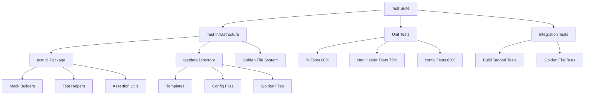
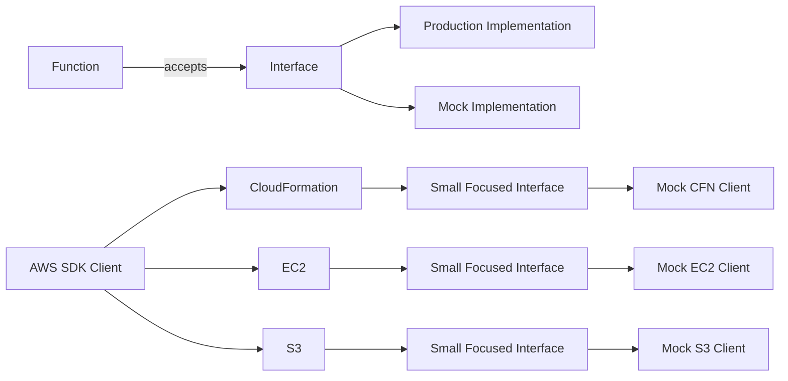

# Test Coverage Improvement Design

## Overview

This design document outlines the technical approach for improving test coverage in the Fog codebase from the current **37.3%** to **80%** overall while uplifting all existing tests to follow Go testing best practices. The design focuses on introducing dependency injection with focused interfaces, creating a comprehensive test infrastructure, and implementing package-specific testing strategies.

### Current State Analysis

**Coverage Baseline:**
- Overall: 37.3% (weighted by package size)
- `lib` package: 66.6% (12 test files, good foundation)
- `cmd` package: 18.9% (1 test file, limited coverage)
- `config` package: 0.0% (no tests)
- `main` package: 0.0% (no tests required)

**Existing Test Patterns:**
- **Slice-based table tests** (needs conversion to map-based)
- **Mock structs with function fields** (good pattern to keep)
- **Global function variable swapping** in cmd tests (needs refactoring)
- **Basic interfaces already exist** in `lib/interfaces.go`
- **Tests use `reflect.DeepEqual`** (needs upgrade to `cmp.Diff`)
- **No golden file testing** infrastructure
- **No shared test utilities** or fixtures

### Design Goals

1. **Achieve 80% overall coverage** with package-specific targets
2. **Introduce dependency injection** without disrupting functionality
3. **Create reusable test infrastructure** (testutil, testdata, golden files)
4. **Uplift all existing tests** to modern Go patterns
5. **Enable local and CI/CD testing** without AWS credentials
6. **Document excluded functions** with refactoring recommendations

## Architecture

### Test Infrastructure Layers



### Dependency Injection Architecture



## Components and Interfaces

### 1. Interface Extraction Strategy

#### Existing Interfaces (lib/interfaces.go)
The codebase already has good foundation with focused interfaces:
- `CloudFormationDescribeStacksAPI`
- `CloudFormationDescribeStackResourcesAPI`
- `CloudFormationDescribeStackEventsAPI`
- `EC2DescribeNaclsAPI`
- `EC2DescribeRouteTablesAPI`

#### New Interface Patterns

**Pattern 1: Single-Method Interfaces**
```go
// lib/s3_interfaces.go
type S3UploadAPI interface {
    PutObject(ctx context.Context, params *s3.PutObjectInput, optFns ...func(*s3.Options)) (*s3.PutObjectOutput, error)
}

type S3HeadAPI interface {
    HeadObject(ctx context.Context, params *s3.HeadObjectInput, optFns ...func(*s3.Options)) (*s3.HeadObjectOutput, error)
}
```

**Pattern 2: Composed Interfaces for Complex Operations**
```go
// lib/cloudformation_interfaces.go
type CFNStackOperationsAPI interface {
    CloudFormationDescribeStacksAPI
    CreateStack(ctx context.Context, params *cloudformation.CreateStackInput, optFns ...func(*cloudformation.Options)) (*cloudformation.CreateStackOutput, error)
    UpdateStack(ctx context.Context, params *cloudformation.UpdateStackInput, optFns ...func(*cloudformation.Options)) (*cloudformation.UpdateStackOutput, error)
    DeleteStack(ctx context.Context, params *cloudformation.DeleteStackInput, optFns ...func(*cloudformation.Options)) (*cloudformation.DeleteStackOutput, error)
}
```

**Pattern 3: Config Loader Interface**
```go
// config/interfaces.go
type AWSConfigLoader interface {
    LoadDefaultConfig(ctx context.Context, optFns ...func(*aws_config.LoadOptions)) (aws.Config, error)
}

type ConfigReader interface {
    ReadFile(filename string) ([]byte, error)
    Unmarshal(data []byte, v any) error
}
```

### 2. Mock Implementation Standards

**Mock Structure Pattern:**
```go
// lib/stacks_test.go
type mockCloudFormationClient struct {
    describeStacksFn func(context.Context, *cloudformation.DescribeStacksInput, ...func(*cloudformation.Options)) (*cloudformation.DescribeStacksOutput, error)
    createStackFn    func(context.Context, *cloudformation.CreateStackInput, ...func(*cloudformation.Options)) (*cloudformation.CreateStackOutput, error)
    updateStackFn    func(context.Context, *cloudformation.UpdateStackInput, ...func(*cloudformation.Options)) (*cloudformation.UpdateStackOutput, error)
    deleteStackFn    func(context.Context, *cloudformation.DeleteStackInput, ...func(*cloudformation.Options)) (*cloudformation.DeleteStackOutput, error)
}

func (m *mockCloudFormationClient) DescribeStacks(ctx context.Context, params *cloudformation.DescribeStacksInput, optFns ...func(*cloudformation.Options)) (*cloudformation.DescribeStacksOutput, error) {
    if m.describeStacksFn != nil {
        return m.describeStacksFn(ctx, params, optFns...)
    }
    return &cloudformation.DescribeStacksOutput{}, nil
}
```

### 3. Test Infrastructure Components

#### testutil Package Structure

```
lib/testutil/
├── builders.go        # Mock client builders
├── fixtures.go        # Test data builders
├── assertions.go      # Custom assertion helpers
├── golden.go          # Golden file utilities
└── helpers.go         # Common test helpers
```

**Mock Builders (testutil/builders.go):**
```go
package testutil

// NewMockCFNClient creates a mock CloudFormation client with sensible defaults
func NewMockCFNClient() *MockCFNClient {
    return &MockCFNClient{
        Stacks: make(map[string]*types.Stack),
    }
}

// WithStack adds a stack to the mock client
func (m *MockCFNClient) WithStack(stack *types.Stack) *MockCFNClient {
    m.Stacks[*stack.StackName] = stack
    return m
}

// WithError configures the mock to return an error
func (m *MockCFNClient) WithError(err error) *MockCFNClient {
    m.Error = err
    return m
}
```

**Test Data Builders (testutil/fixtures.go):**
```go
// StackBuilder builds test stacks with sensible defaults
type StackBuilder struct {
    stack types.Stack
}

func NewStackBuilder(name string) *StackBuilder {
    return &StackBuilder{
        stack: types.Stack{
            StackName:   &name,
            StackStatus: types.StackStatusCreateComplete,
            CreationTime: aws.Time(time.Now()),
        },
    }
}

func (b *StackBuilder) WithStatus(status types.StackStatus) *StackBuilder {
    b.stack.StackStatus = status
    return b
}

func (b *StackBuilder) Build() *types.Stack {
    return &b.stack
}
```

**Golden File Support (testutil/golden.go):**
```go
// GoldenFile manages golden file testing
type GoldenFile struct {
    t         *testing.T
    updateFlag bool
    dir       string
}

func NewGoldenFile(t *testing.T) *GoldenFile {
    return &GoldenFile{
        t:          t,
        updateFlag: flag.Lookup("update") != nil && flag.Lookup("update").Value.String() == "true",
        dir:        "testdata/golden",
    }
}

func (g *GoldenFile) Assert(name string, actual []byte) {
    t.Helper()

    goldenPath := filepath.Join(g.dir, name+".golden")

    if g.updateFlag {
        err := os.WriteFile(goldenPath, actual, 0644)
        require.NoError(g.t, err, "Failed to update golden file")
        return
    }

    expected, err := os.ReadFile(goldenPath)
    require.NoError(g.t, err, "Failed to read golden file")

    if diff := cmp.Diff(string(expected), string(actual)); diff != "" {
        g.t.Errorf("Golden file mismatch (-want +got):\n%s", diff)
    }
}
```

#### testdata Directory Structure

```
testdata/
├── templates/
│   ├── simple-vpc.yaml
│   ├── complex-stack.yaml
│   └── invalid-template.yaml
├── config/
│   ├── valid-config.yaml
│   ├── valid-config.json
│   ├── valid-config.toml
│   └── invalid-config.yaml
├── golden/
│   ├── deploy/
│   │   ├── new-stack.golden
│   │   └── update-stack.golden
│   ├── drift/
│   │   └── drift-report.golden
│   └── changesets/
│       └── changeset-output.golden
└── fixtures/
    ├── stack-events.json
    └── stack-resources.json
```

## Data Models

### Test Configuration Models

```go
// testutil/config.go
type TestConfig struct {
    // AWS Mock Configuration
    MockAWS struct {
        Region    string
        AccountID string
        Profile   string
    }

    // Test Environment
    Environment struct {
        SkipIntegration bool
        UpdateGolden    bool
        Verbose         bool
    }
}

// TestContext carries test-specific context
type TestContext struct {
    T          *testing.T
    Config     *TestConfig
    MockClients MockClients
    GoldenFile *GoldenFile
}

// MockClients holds all mock AWS clients
type MockClients struct {
    CFN         *MockCFNClient
    EC2         *MockEC2Client
    S3          *MockS3Client
    SSO         *MockSSOClient
    Organizations *MockOrgClient
}
```

### Table-Driven Test Structure

```go
// Standard map-based table test structure
type TestCase struct {
    name      string
    input     TestInput
    setup     func(*TestContext)
    want      TestOutput
    wantErr   bool
    errMsg    string
}

func TestFunction(t *testing.T) {
    tests := map[string]TestCase{
        "successful case": {
            input: TestInput{...},
            setup: func(ctx *TestContext) {
                ctx.MockClients.CFN.WithStack(...)
            },
            want: TestOutput{...},
        },
        "error case": {
            input: TestInput{...},
            setup: func(ctx *TestContext) {
                ctx.MockClients.CFN.WithError(errors.New("API error"))
            },
            wantErr: true,
            errMsg: "API error",
        },
    }

    for name, tc := range tests {
        tc := tc // capture range variable
        t.Run(name, func(t *testing.T) {
            t.Parallel()

            ctx := NewTestContext(t)
            if tc.setup != nil {
                tc.setup(ctx)
            }

            got, err := FunctionUnderTest(tc.input, ctx.MockClients.CFN)

            if tc.wantErr {
                require.Error(t, err)
                if tc.errMsg != "" {
                    assert.Contains(t, err.Error(), tc.errMsg)
                }
                return
            }

            require.NoError(t, err)
            assert.Equal(t, tc.want, got)
        })
    }
}
```

## Error Handling

### Test Error Patterns

1. **Mock Error Injection**
```go
type MockError struct {
    Operation string
    Code      string
    Message   string
}

func (m *MockCFNClient) InjectError(err MockError) {
    m.errorMap[err.Operation] = err
}
```

2. **Error Assertion Helpers**
```go
func AssertAWSError(t *testing.T, err error, expectedCode string) {
    t.Helper()
    var awsErr *types.ValidationException
    require.ErrorAs(t, err, &awsErr)
    assert.Equal(t, expectedCode, awsErr.ErrorCode())
}
```

3. **Timeout and Context Testing**
```go
func TestWithTimeout(t *testing.T) {
    ctx, cancel := context.WithTimeout(context.Background(), 100*time.Millisecond)
    defer cancel()

    mock := &MockCFNClient{
        describeStacksFn: func(ctx context.Context, ...) (*cloudformation.DescribeStacksOutput, error) {
            <-ctx.Done()
            return nil, ctx.Err()
        },
    }

    _, err := FunctionUnderTest(ctx, mock)
    require.ErrorIs(t, err, context.DeadlineExceeded)
}
```

## Testing Strategy

### Package-Specific Approaches

#### 1. lib Package (Target: 80%)

**Approach:** Pure unit testing with dependency injection

**Files Requiring Tests:**
- `changesets.go` - Already has tests, needs uplift
- `drift.go` - Has tests, needs expansion
- `ec2.go` - Has minimal tests, needs comprehensive coverage
- `files.go` - Has tests, needs modern patterns
- `identitycenter.go` - Has tests, needs expansion
- `logging.go` - Has basic tests, needs error cases
- `outputs.go` - Has tests, needs edge cases
- `resources.go` - Has tests, needs uplift
- `stacks.go` - Well tested, needs pattern updates
- `template.go` - Has tests, needs validation coverage

**Testing Patterns:**
```go
// Before: Global function variable
var describeStacks = func(...) {...}

// After: Interface injection
func GetStackInfo(ctx context.Context, client CloudFormationDescribeStacksAPI, stackName string) (*DeployInfo, error) {
    // implementation
}
```

#### 2. cmd Package (Target: Helper Functions 75%)

**Approach:** Unit tests for helpers, integration tests for workflows, golden files for output

**Files to Test:**
- `deploy_helpers.go` - Extract and test helper functions
- `tables.go` - Test table formatting with golden files
- `helpers.go` - Test utility functions
- `flaggroups.go` - Test flag validation logic

**Files to Exclude (350+ lines, orchestration-heavy):**
- `deploy.go` (409 lines) - Flag for refactoring
- `report.go` (360 lines) - Flag for refactoring
- Other command files with heavy Cobra integration

**Extraction Pattern:**
```go
// Extract from deploy.go
func validateDeploymentFlags(flags DeployFlags) error {
    // validation logic
}

func prepareDeploymentInfo(template string, stackName string) (*DeployInfo, error) {
    // preparation logic
}

// Test the extracted functions
func TestValidateDeploymentFlags(t *testing.T) {
    // test implementation
}
```

#### 3. config Package (Target: 80%)

**Approach:** Pure unit tests with mock file system and AWS config

**Files to Test:**
- `awsconfig.go` - Mock AWS SDK config loading
- `config.go` - Test all configuration formats

**Testing Pattern:**
```go
type mockConfigLoader struct {
    loadFn func(context.Context, ...func(*config.LoadOptions)) (aws.Config, error)
}

func TestLoadAWSConfig(t *testing.T) {
    tests := map[string]struct {
        mockSetup func(*mockConfigLoader)
        input     ConfigInput
        want      AWSConfig
        wantErr   bool
    }{
        // test cases
    }
}
```

### Integration Testing Strategy

**Build Tags and Environment Variables:**
```go
//go:build integration
// +build integration

package cmd

import "testing"

func TestDeployIntegration(t *testing.T) {
    if os.Getenv("INTEGRATION") != "1" {
        t.Skip("Skipping integration test")
    }

    // Integration test implementation
}
```

**Golden File Testing for Output:**
```go
func TestReportOutput(t *testing.T) {
    golden := testutil.NewGoldenFile(t)

    output := captureOutput(func() {
        runReportCommand(mockData)
    })

    golden.Assert("report-output", output)
}
```

### Test Execution Phases

1. **Phase 1: Infrastructure Setup**
   - Create `lib/testutil` package
   - Set up `testdata` directory structure
   - Implement golden file utilities
   - Add `github.com/google/go-cmp/cmp` dependency

2. **Phase 2: Interface Extraction**
   - Define new interfaces in respective packages
   - Update function signatures to accept interfaces
   - Maintain backward compatibility where possible

3. **Phase 3: Existing Test Uplift**
   - Convert slice-based to map-based table tests
   - Replace `reflect.DeepEqual` with `cmp.Diff`
   - Add `t.Helper()` to helper functions
   - Update to `got`/`want` naming convention
   - Add `t.Parallel()` where appropriate

4. **Phase 4: New Test Implementation**
   - **lib package**: Add missing unit tests
   - **config package**: Implement comprehensive tests
   - **cmd package**: Test helper functions, add golden tests

5. **Phase 5: Integration and Validation**
   - Add integration tests with build tags
   - Validate coverage targets
   - Document excluded functions
   - Update CI/CD configuration

## Implementation Checklist

### Test Infrastructure
- [ ] Create `lib/testutil` package structure
- [ ] Implement mock client builders
- [ ] Create test data builders with defaults
- [ ] Implement golden file testing utilities
- [ ] Set up `testdata` directory with fixtures
- [ ] Add `github.com/google/go-cmp/cmp` to go.mod

### Interface Extraction
- [ ] Extend interfaces in `lib/interfaces.go`
- [ ] Create `config/interfaces.go`
- [ ] Update function signatures in lib package
- [ ] Update function signatures in config package
- [ ] Extract testable functions from cmd package

### Test Uplift
- [ ] Convert 12 existing test files to map-based tables
- [ ] Replace `reflect.DeepEqual` with `cmp.Diff`
- [ ] Add `t.Helper()` to test helpers
- [ ] Update to `got`/`want` naming
- [ ] Add `t.Parallel()` where safe
- [ ] Replace global function variables with DI

### New Tests
- [ ] Achieve 80% coverage in lib package
- [ ] Achieve 80% coverage in config package
- [ ] Test helper functions in cmd package
- [ ] Add golden file tests for outputs
- [ ] Create integration tests with build tags

### Documentation
- [ ] Document excluded cmd functions
- [ ] Create testing guidelines document
- [ ] Update README with test running instructions
- [ ] Document coverage improvement metrics

## Coverage Exclusions

### Functions Excluded from Coverage Requirements

**cmd/deploy.go (409 lines)**
- `deployCmd()` - Cobra command setup and orchestration
- Reason: >80% AWS API calls, heavy Cobra integration
- Recommendation: Extract validation and preparation logic

**cmd/report.go (360 lines)**
- `reportCmd()` - Complex reporting orchestration
- Reason: Heavy AWS API orchestration, output formatting
- Recommendation: Extract report generation logic

**Other cmd files**
- Main command functions with Cobra setup
- Reason: Framework integration, minimal business logic
- Recommendation: Focus on testing extracted helpers

## Validation and Quality Gates

### Pre-Implementation Validation
- Run existing tests to establish baseline
- Verify no breaking changes with interface extraction
- Validate mock patterns with simple proof-of-concept

### During Implementation
- Run tests after each file modification
- Use `go fmt` on all modified files
- Run `golangci-lint` to catch issues early
- Track coverage improvements incrementally

### Post-Implementation Validation
```bash
# All tests must pass
go test ./...

# Check coverage meets targets
go test ./... -cover

# Run with race detection
go test -race ./...

# Verify formatting
go fmt ./...

# Run linter
golangci-lint run

# Run integration tests (manual)
INTEGRATION=1 go test ./... -tags=integration

# Update golden files if needed
go test ./... -update
```

### Success Criteria
- ✅ Overall coverage ≥ 80%
- ✅ lib package coverage ≥ 80%
- ✅ config package coverage ≥ 80%
- ✅ All existing tests pass
- ✅ All tests run without AWS credentials
- ✅ No race conditions detected
- ✅ Code passes golangci-lint
- ✅ Golden file tests implemented
- ✅ Integration tests with build tags

## Risk Mitigation

### Identified Risks and Mitigations

1. **Risk:** Breaking existing functionality
   - **Mitigation:** Incremental changes, maintain backward compatibility
   - **Mitigation:** Run full test suite after each change

2. **Risk:** Interface changes affecting external users
   - **Mitigation:** Keep exported APIs stable where possible
   - **Mitigation:** Document any breaking changes clearly

3. **Risk:** Mock complexity growing unmanageable
   - **Mitigation:** Keep interfaces small and focused
   - **Mitigation:** Use builder pattern for mock setup

4. **Risk:** Test maintenance burden
   - **Mitigation:** Comprehensive test utilities in testutil
   - **Mitigation:** Golden files for complex output validation

5. **Risk:** Coverage targets not achievable
   - **Mitigation:** Document exclusions with justification
   - **Mitigation:** Focus on meaningful tests over metrics

## Appendix: Code Examples

### Example: Refactored Stack Test
```go
package lib

import (
    "context"
    "testing"
    "time"

    "github.com/ArjenSchwarz/fog/lib/testutil"
    "github.com/aws/aws-sdk-go-v2/service/cloudformation/types"
    "github.com/google/go-cmp/cmp"
    "github.com/stretchr/testify/assert"
    "github.com/stretchr/testify/require"
)

func TestGetStackInfo(t *testing.T) {
    t.Helper()

    tests := map[string]struct {
        name    string
        setup   func(*testutil.TestContext)
        want    *DeployInfo
        wantErr bool
        errMsg  string
    }{
        "existing stack": {
            name: "test-stack",
            setup: func(ctx *testutil.TestContext) {
                stack := testutil.NewStackBuilder("test-stack").
                    WithStatus(types.StackStatusCreateComplete).
                    WithParameter("Env", "prod").
                    Build()
                ctx.MockClients.CFN.WithStack(stack)
            },
            want: &DeployInfo{
                StackName: "test-stack",
                IsNew:     false,
                StackArn:  "arn:aws:cloudformation:us-west-2:123456789012:stack/test-stack/abc",
            },
        },
        "new stack": {
            name: "new-stack",
            setup: func(ctx *testutil.TestContext) {
                ctx.MockClients.CFN.WithError(ErrStackNotFound)
            },
            want: &DeployInfo{
                StackName: "new-stack",
                IsNew:     true,
            },
        },
        "API error": {
            name: "error-stack",
            setup: func(ctx *testutil.TestContext) {
                ctx.MockClients.CFN.WithError(errors.New("API throttled"))
            },
            wantErr: true,
            errMsg:  "API throttled",
        },
    }

    for name, tc := range tests {
        tc := tc // capture range variable
        t.Run(name, func(t *testing.T) {
            t.Parallel()

            ctx := testutil.NewTestContext(t)
            if tc.setup != nil {
                tc.setup(ctx)
            }

            got, err := GetStackInfo(context.Background(), ctx.MockClients.CFN, tc.name)

            if tc.wantErr {
                require.Error(t, err)
                if tc.errMsg != "" {
                    assert.Contains(t, err.Error(), tc.errMsg)
                }
                return
            }

            require.NoError(t, err)
            if diff := cmp.Diff(tc.want, got, testutil.StackComparer); diff != "" {
                t.Errorf("GetStackInfo() mismatch (-want +got):\n%s", diff)
            }
        })
    }
}
```

### Example: Golden File Test
```go
func TestChangesetOutput(t *testing.T) {
    golden := testutil.NewGoldenFile(t)

    changeset := &ChangesetInfo{
        Name:         "test-changeset",
        Status:       "CREATE_COMPLETE",
        CreationTime: time.Date(2024, 1, 1, 0, 0, 0, 0, time.UTC),
        Changes: []Change{
            {
                Type:       "Resource",
                Action:     "Add",
                ResourceID: "MyBucket",
            },
        },
    }

    output := FormatChangeset(changeset)
    golden.Assert("changeset-output", []byte(output))
}
```

### Example: Config Package Test
```go
package config

import (
    "context"
    "testing"

    "github.com/ArjenSchwarz/fog/lib/testutil"
    "github.com/stretchr/testify/assert"
    "github.com/stretchr/testify/require"
)

func TestLoadConfig(t *testing.T) {
    tests := map[string]struct {
        filename string
        content  string
        want     Config
        wantErr  bool
    }{
        "valid YAML": {
            filename: "config.yaml",
            content: `
region: us-west-2
profile: default
templates:
  directory: ./templates
`,
            want: Config{
                Region:  "us-west-2",
                Profile: "default",
                Templates: TemplateConfig{
                    Directory: "./templates",
                },
            },
        },
        "valid JSON": {
            filename: "config.json",
            content: `{
                "region": "us-east-1",
                "profile": "prod"
            }`,
            want: Config{
                Region:  "us-east-1",
                Profile: "prod",
            },
        },
        "invalid format": {
            filename: "config.yaml",
            content:  "invalid: [unclosed",
            wantErr:  true,
        },
    }

    for name, tc := range tests {
        tc := tc
        t.Run(name, func(t *testing.T) {
            t.Parallel()

            reader := &mockConfigReader{
                files: map[string][]byte{
                    tc.filename: []byte(tc.content),
                },
            }

            got, err := LoadConfig(tc.filename, reader)

            if tc.wantErr {
                require.Error(t, err)
                return
            }

            require.NoError(t, err)
            assert.Equal(t, tc.want, got)
        })
    }
}
```